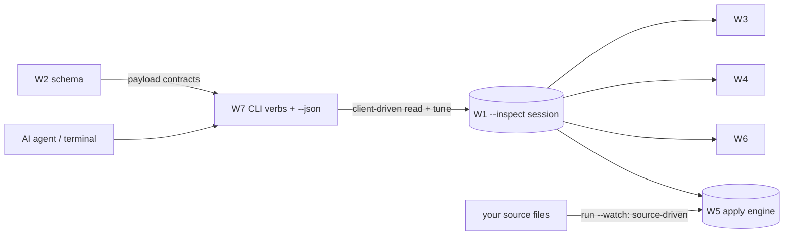

# Spec: the CLI facade (W7)

> **Status:** 🟡 Draft v0.2 — the terminal + agent-facing client of the **inspect** surface.
> **Branch:** `winui-devex` · **Owner:** (you) · **Workstream:** W7
> **Related:** `winapp-run-inspect.md` (W1 — hosts the session this connects to; owns `--inspect` /
> `--watch`) · `winapp-devtools-protocol.md` (W2 — the families these verbs mirror) ·
> `winapp-devtools-read.md` (W3) · `winapp-devtools-provenance.md` (W4) ·
> `winapp-devtools-selection.md` (W6) — the capabilities it surfaces ·
> `winapp-devtools-hot-reload.md` (W5 — see §4: the CLI does **not** re-expose the file-watch loop).

---

## 1. Summary

W7 is the **command-line client** of the live-inspect surface: a small set of `winapp` verbs that connect
to a running `winapp run --inspect` session (W1) and issue **client-driven** protocol operations — read the
live visual tree, read properties with value-source, resolve source, select/annotate an element, and edit a
property value — all with **`--json`** so an **AI agent shelling out** gets structured access to a running
WinUI UI (not screenshots).

**Why CLI-first (an endorsed principle):** an agent that can call `winapp … --json` gets XAML sight with no
GUI and no extra host. The `--json` surface *is* the machine contract, and it's the cheapest way to prove
the protocol is usable by a non-visual client.

**What's grounded vs proposed (stated honestly):**
- **Grounded** — the *engine operations* the verbs call are proven by the proof-of-concept: enumerate the
  tree, read properties with value-source precedence, and set a property on a live element.
- **Proposed / open** — the *verb ergonomics* (names, grouping, `--json` shapes) are a design sketch, not
  settled (Q-VERB-SHAPE). This spec commits to the **capabilities** and the **honesty contract**, not to a
  final verb table.

---

## 2. Goals & non-goals

| ID | Goal |
|----|------|
| **G1** | Surface the **client-driven capability families** — read · select/annotate · property-tune — as ergonomic `winapp` verbs, each with `--json`. |
| **G2** | Be **agent-usable**: deterministic `--json`, stable exit codes, no interactive prompts in `--json` mode. |
| **G3** | Address a **session** cleanly (default to the single active `--inspect` session; require `--session` when ambiguous). |
| **G4** | Preserve the engine's **honesty** verbatim: surface `Outcome`, `Confidence`, `TransactionState`, `ReasonCode`, so an agent sees `applied` vs `applied-inert`, and `low`-confidence source as low. |
| **G5** | Keep `--json` payloads **schema-bound** (validated against W2) so the machine contract can't silently drift from the protocol. |

**Non-goals**
- **Not the hot-reload file-watch.** Source-driven hot reload is `winapp run --watch` (W1/W5), a mode of
  `run` — the facade does **not** re-expose it as a verb (see §4).
- **No rendering.** Visual tree/overlay rendering is the designer surface (W9); the CLI emits data.
- **No engine logic.** W7 is a thin client over the daemon (W1); it holds no diagnostics state.
- **No v1 structural/persist verbs.** Client-driven mutation in v1 is **property-tune only**; structural
  authoring is the next milestone (owned by W9) and its verbs land then.

---

## 3. Proposed CLI UX

The session is launched by `winapp run --inspect` (W1). W7 adds verbs that **connect to that session** and
issue client-driven commands. The names below are a **proposal** (Q-VERB-SHAPE), grouped by capability
rather than mechanically mirroring every protocol method:

| Verb (proposed) | Protocol command | Risk tier | Milestone |
|---|---|---|---|
| `winapp inspect tree [--depth n]` | `VisualTree.getRoot` / `getChildren` | read | v1 |
| `winapp inspect props <handle>` | `Property.get` (with value-source) | read | v1 |
| `winapp inspect resource <key>` | `Resource.resolve` | read | v1 |
| `winapp inspect source <handle>` | `Source.resolve` (graded — W4) | read | v1 |
| `winapp select --point x,y` \| `--handle h` | `Selection.pick` / `selectByHandle` | mutate-ephemeral | v1 |
| `winapp annotate <handle> --label "…"` \| `--clear` | `Selection.annotate` / `clear` | mutate-ephemeral | v1 |
| `winapp set-prop <handle> <prop> <value>` | `Property.set` (four-outcome) | mutate-ephemeral | v1 |
| *(structural authoring verbs)* | `HotReload.*` structural / persist | structural → persist | **next (W9)** |

- **`--json`** on every verb → the machine contract; without it, a human-readable table/tree.
- **`--session <id>`** selects among concurrent sessions; omitted → the single active one (error if
  ambiguous, matching W1's session model).
- **Exit codes** map to the protocol error space (non-zero + e.g. `Unauthorized` / `TargetLost` in the JSON
  body) so a script can branch without parsing prose.

---

## 4. The CLI and hot reload (what's deliberately *not* here)

Hot reload has **two drivers** (overview §3); only one is a CLI-facade concern:

| Driver | Surface | Owned by | A CLI verb? |
|---|---|---|---|
| **Source-driven** — watch project files, re-apply on save | `winapp run --watch` (a `run` mode) | W1 + W5 | **No** — a flag on `run`, not a facade verb |
| **Client-driven** — a client issues a typed mutation over the protocol | the CLI facade (`set-prop`; later structural authoring) | W7 → W5 | **Yes** — `set-prop` now, authoring later |

So there is **no `winapp watch` and no `winapp apply <file>`** in the facade: `--watch` already *is* the
file-watch loop, and there is no coherent "apply an edit file" operation — client-driven mutation is a
**typed protocol call** (`Property.set`, later structural), not a file hand-off. Both drivers go through the
**same apply engine** (W5) and get the **same four-outcome honesty**, so a file-save edit and an agent
`set-prop` are classified and reported identically.

---

## 5. The honesty contract at the CLI

The CLI must not launder the engine's honesty. When a `set-prop` commits but the re-read doesn't confirm the
render, the CLI reports `applied-inert` — never `applied`. When source resolution is `low` confidence, the
CLI surfaces `low`. When an operation is refused, the CLI returns `RefusedUnsafe` with the `ReasonCode`.
This is what lets a **blind agent** trust the tool: the terminal output is exactly as truthful as the
engine.

```jsonc
// winapp set-prop 0x1F2 Width 400 --json
{
  "outcome": "applied",          // or "applied-inert" if the re-read didn't confirm the render
  "handle": "0x1F2",
  "property": "Width",
  "valueSource": "local",
  "verified": true
}
```

---

## 6. Schema-bound payloads (grounding the "no-drift" claim)

The `--json` payloads are **bound to the W2 schema** — validated against it in the standing gate — so the
machine contract can't silently diverge from the protocol. As much of that payload layer as practical is
**generated** from the schema; the verb ergonomics (names/grouping) are a thin hand-authored layer on top
(Q-VERB-SHAPE). The value being defended is **contract fidelity**, not literal end-to-end code-gen: because
the payloads are schema-derived, the same approach lets **additional clients** be built against the one
schema without a protocol change.

---

## 7. Backward compatibility & the standing gate

W7 adds new verbs; it changes no existing `winapp` command. The `run --inspect` / `--watch` flags live in W1.

**Standing W7 gate:** a **CLI conformance** run — the `--json` payload for each supported verb validates
against the W2 schema, the honest outcomes round-trip (`applied` vs `applied-inert`, graded confidence), and
the error space maps to exit codes. (Payload/behavior conformance — *not* "every protocol method has a
verb.")

**Testing:** golden `--json` snapshots per verb; exit-code tests for the error space; an agent-simulation
test that inspects → `set-prop` → re-reads entirely through the CLI.

---

## 8. Decisions & open questions

**Resolved:** CLI-first is the agent contract; the facade is the *client-driven* inspect + tune surface;
source-driven hot reload stays on `run --watch` (not a verb); `--json` payloads are schema-bound; the CLI
preserves engine honesty verbatim.

**Open:**
- **Q-VERB-SHAPE — verb names & grouping.** Flat verbs (`winapp inspect …`, `winapp set-prop …`) vs a
  `winapp devtools …` group vs a XAML mode under `winapp ui`. Ties to the overview's Q-NAME.
- **Q-SESSION-ADDRESSING — how a separate invocation targets the session.** A one-shot `winapp inspect …`
  from a second terminal must find the `--inspect` daemon: default-single-session, `--session <id>`, or a
  discovery file? Baseline: default-single + `--session` (W1's model).
- **Q-STREAM — event streaming.** How protocol events (tree changes, `consentRequired`) reach a CLI client:
  a `--follow` NDJSON stream vs a notifications file. Baseline: `--follow` NDJSON.

## 9. Rough implementation phases

1. **Read verbs.** tree / props / resource / source — the W3/W4 surface + `--json` payloads.
2. **Select + tune.** select / annotate + `set-prop` — the W6 + tier-1 W5 surface, with four-outcome honesty.
3. **Conformance.** the schema-bound payload gate + the agent-simulation test.
4. **(Next milestone, with W9) Authoring verbs.** structural / persist once the census + consent gates clear.

## Appendix — where W7 sits


