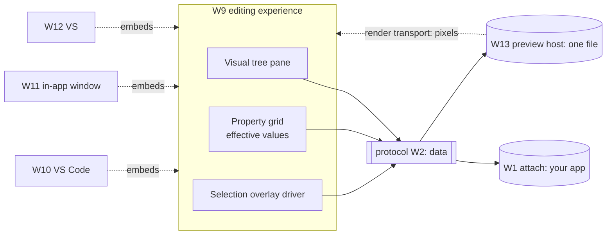

# Spec: the editing experience — visualizer → designer (W9)

> **Status:** 🟡 Draft v0.2 — the **editing experience** layered over a live instance (attach **or**
> preview). One surface, a capability gradient, two front doors — not two products.
> **Branch:** `winui-devex` · **Owner:** (you) · **Workstream:** W9
> **Related — the two render substrates it sits on:** `winapp-run-inspect.md` (W1, the **attach** front
> door — your running app) · `winapp-devtools-preview-host.md` (W13, the **preview** front door — a host
> over one file). **What it uses:** `winapp-devtools-read.md` (W3, what it renders) ·
> `winapp-devtools-selection.md` (W6, pick + overlay) · `winapp-devtools-hot-reload.md` (W5, the edits it
> drives + persist) · `winapp-devtools-protocol.md` (risk tiers = the gradient). **Hosts:**
> `winapp-devtools-vscode.md` (W10), `winapp-devtools-inapp-window.md` (W11),
> `winapp-devtools-visual-studio.md` (W12).

---

## 1. Summary

W9 is the **editing experience**: a visual-tree pane, a **property grid of live effective values**, a
selection overlay, and — progressively — the ability to **edit** what you see. It is **not** the thing
that renders your UI and it is **not** the protocol; it is the **UX layered on top of a live WinUI
instance**, which it reads and mutates over the protocol. That instance reaches it through **one of two
front doors**:

> **Two front doors, one surface.** **Attach** — your *running app* (W1 `run --inspect`); the app is on
> screen and the overlay draws in place. **Preview** — a *preview host* (W13) that loads a **single XAML
> file** with no app of yours running and **streams its pixels** into the panel. The surface is
> **identical** over either; only the render substrate underneath differs.

It stays **one surface with a capability gradient**, not a separate "visualizer" and "designer":

> **visualizer → designer is a dial, not a fork.** The same surface starts read-only (inspect), then
> enables set-property (ephemeral), then structural edits, then persist-to-source. Each notch maps
> **1:1 onto a protocol risk tier** (W2 / W8). The **preview** front door is where the classic
> file-focused **designer** (edit a file → persist to its source) primarily lives; **attach** is "live
> DevTools, with edits" on your real app.

**v1 scope (decided):** **read + basic property editing** — render the tree, select, inspect properties,
and edit property *values* live (tier 0 + tier 1). **Structural edits and persist-to-source are the
immediate next milestone** (tiers 2–3) — the **designer authoring** the community ranks a top-priority
ask, prioritized in the main plan (**not deferred**) and gated on the census (W4) + consent (W8).
**Front-door phasing:** attach-mode rides the inspect stack and can ship first; the **preview** front
door is gated on the **W13 rendering engine** (see overview milestones).

W9 **holds no rendering and no diagnostics logic** — rendering is **W13**, the live tree/apply is
W1/W3/W5, the contract is W2. That is the reuse seam: the editing experience is shaped **as we see fit**
on top, and the same surface is hosted in **Visual Studio (W12) — its headline home** — VS Code (W10),
and the in-app window (W11), without change.

---

## 2. Goals & non-goals

| ID | Goal |
|----|------|
| **G1** | Render the live visual tree + a property grid of **effective values** (W3), updating as the instance changes. |
| **G2** | Drive **selection** both ways: pick in the app → highlight in the tree, and pick in the tree → overlay in the app (W6). |
| **G3** | **v1 editing:** edit property *values* live (tier-1 `Property.set`), with the four-outcome result shown honestly (applied vs applied-inert). |
| **G4** | Show **provenance honestly:** render W4's confidence (exact/high/low/none) as a visible signal, never a false certainty. |
| **G5** | Be **host-agnostic:** the surface is a reusable component the W10/W11/W12 hosts embed; no engine logic lives in it. |
| **G6** | Expose the **capability gradient** as UI state: locked notches for structural/persist until their milestone + grant. |
| **G7** | **Composite two channels:** overlay the protocol-driven tree/grid/selection on top of the substrate's view — the app *in place* (attach) or the **streamed pixels** (preview, W13's render transport). |

**Non-goals (v1)**
- **No structural editing / no persist-to-source in v1** — these are the **immediate next milestone**
  (not deferred), behind the W4/W8 gates. The UI shows them as locked, not absent, so the gradient is
  legible.
- **No rendering engine** — W9 does **not** load or render XAML; it consumes a live instance from W1
  (attach) or W13 (preview). The pixel/render transport is produced by **W13**, not here.
- **No engine/diagnostics logic** — W9 is a thin visual client.
- **No bespoke protocol** — it speaks the one protocol.

---

## 3. The capability gradient (the core idea)

| Notch | Capability | Protocol tier | Milestone |
|---|---|---|---|
| **Inspect** | tree + property + resource + source (graded) read | read (0) | **v1** |
| **Tune** | edit property values live | mutate-ephemeral (1) | **v1** |
| **Compose** | add/remove/reparent elements in-session | structural (2) | **next** |
| **Persist** | write edits back to source files | persist (3) | **next** |

The gradient is the product story: a developer starts by *looking*, then *tweaking*, then *building*,
then *saving* — the same surface the whole way, with each step gated by capability + consent. This is
what makes "designer" an **evolution of the visualizer** rather than a separate tool.

---

## 4. Surface anatomy

- **Visual tree pane** — the W3 tree; expand/collapse, live updates, selection highlight.
- **Property grid** — W3 properties with **value-source** badges (local/style/inherited/…); v1 lets you
  edit values (tier 1).
- **Selection overlay driver** — issues W6 pick/highlight; the actual overlay renders over the app
  (out-of-process, non-invasive).
- **Provenance affordance** — when a node is selected, W4's confidence is shown as a badge; `low`/`none`
  never renders as a definitive source link.

### 4.1 Substrate & transports (what W9 stands on)

The surface reads and edits over **one protocol**, but the **view** it overlays depends on the front door:

| | **Attach** (W1) | **Preview** (W13) |
|---|---|---|
| Live instance | *your* running app | a preview host over **one file** |
| Data (tree/props/edits) | protocol (W2) | protocol (W2) |
| The rendered view | your app **on screen**; overlay drawn **in place** (W6) | host **pixels streamed** into the panel; overlay composited **in-panel** |
| Durable edit target | your app (ephemeral) or source (persist) | the **file's source** (persist is the point) |

W9 **consumes** the render transport (preview) but never **produces** it — that's W13. This is why the
same surface serves both doors: the protocol is identical; only whether pixels are streamed differs.

---

## 5. Host-agnostic contract

W9 defines the **visual experience + interaction model**; it does not choose *where* it runs. Hosts
(W10/W11/W12) provide the frame (a VS Code webview, an in-app window, a VS tool-window) and editor
integration (e.g. select-to-source jumping to a file — a host concern). Because W9 speaks only the
protocol, adding a host is additive and requires **no** change to W9 or the engine.

This is also the ecosystem hedge the debate demanded: a single visual surface that can appear in
**Visual Studio (W12) and VS Code (W10)**, or with no external IDE at all (in-app, W11) — reusing one
investment across every host.

---

## 6. Backward compatibility & the standing gate

W9 is new; it changes no existing behavior. It ships **inside a host** (v1: W11 in-app and/or W10 VS
Code), so its gate rides the host's.

**Standing W9 gate:** a **round-trip render test** — attach to the live fixture, render the tree +
properties, select an element both directions, edit a property value, and confirm the surface shows the
**honest** outcome (applied vs applied-inert) and the **honest** provenance badge. The gate fails if the
surface ever renders a `low`/`none`-confidence source as certain, or shows `applied` for an unverified
edit.

**Testing:** component tests against a recorded protocol session (deterministic) + a live smoke inside
one host.

---

## 7. Decisions & open questions

**Resolved:** one surface, capability gradient = risk tiers; v1 = read + property editing; structural +
persist = the immediate next milestone (not deferred); host-agnostic thin client; provenance rendered
honestly.

**Open:**
- **Q-FRONT-DOOR-PHASING — which door ships first.** Attach-mode rides the inspect stack (no new
  engine); preview-mode needs the W13 rendering engine. Baseline: attach-first, preview gated on W13.
- **Q-COMPOSITE — overlaying data on streamed pixels.** In preview mode the tree/grid/selection overlay
  must register precisely over W13's pixel stream across DPI/resize. Baseline: W13 supplies the
  transform metadata; W9 composites.
- **Q-RENDER-TECH — how the surface UI is built** so it embeds in a VS Code webview *and* an in-app WinUI
  window with maximal reuse. Baseline: a portable view layer the hosts frame; revisit per host.
- **Q-TREE-SCALE — big-tree performance** (virtualization) in the tree pane for large apps.
- **Q-GRADIENT-UNLOCK — how a notch unlocks:** automatic once its milestone ships + grant present, vs an
  explicit mode toggle. Baseline: gated by capability + W8 grant, surfaced as a mode.
- **Q-EDITOR-JUMP — does select-to-source live here or in the host?** Baseline: W9 emits the resolved
  `Source` (graded); the *host* performs the editor navigation (W10).

## 8. Rough implementation phases

1. **Read surface.** Tree pane + property grid from W3; live updates.
2. **Selection.** Two-way pick + overlay via W6; provenance badge from W4.
3. **Tune.** Tier-1 property-value editing with honest four-outcome display.
4. **Host embed.** Package as the reusable surface W11/W10 frame.
5. **(Later) Compose + Persist.** Structural + source-write notches behind W4/W8 gates.

## Appendix — relationship to substrates & hosts

W9 is the *what* (the editing experience). **Below** it: the render substrate — W1 (attach: your app)
or W13 (preview: a host over one file) — presents a live tree over the protocol; W13 also streams
pixels. **Around** it: W10/W11/W12 are the *where* (the frames). One surface, two front doors, many
hosts, one protocol.
