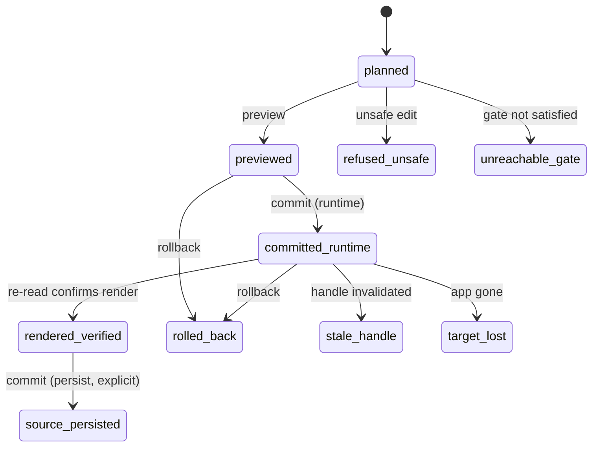
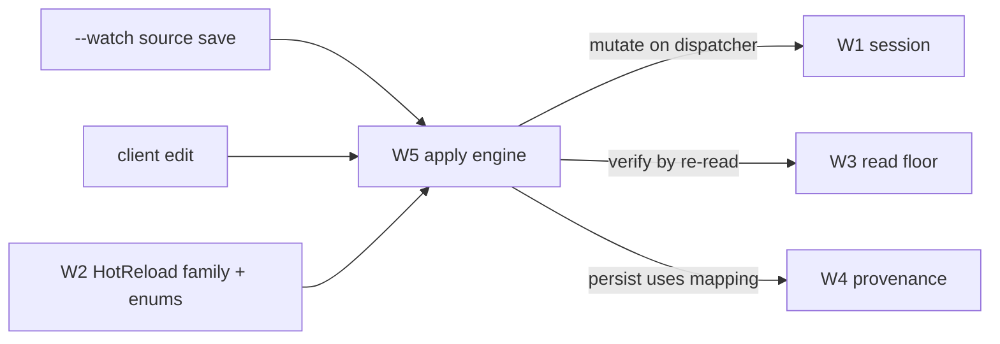

# Spec: hot reload — the mutation & apply engine (W5)

> **Status:** 🟡 Draft v0.1 — the differentiating capability. XAML **and** C#, source-driven or
> client-driven, with an honest per-edit outcome.
> **Branch:** `winui-devex` · **Owner:** (you) · **Workstream:** W5
> **Related:** `winapp-devtools-protocol.md` (the `HotReload` family + `Outcome` / `TransactionState`
> / `ReasonCode` enums) · `winapp-run-inspect.md` (the `--watch` host + UI dispatcher) ·
> `winapp-devtools-read.md` (re-read to **verify** an apply) · `winapp-devtools-provenance.md`
> (source mapping for persist).

---

## 1. Summary

W5 is the apply path: take an edit — a property change, a XAML structure change, a C# method-body
change — and make it live in the running WinUI app **without a restart when possible**, reporting an
**honest outcome** for every edit. It is what makes `winapp run --watch` a real hot-reload loop and
what lets a client (or agent, or the designer) commit an edit and know whether it actually took effect.

Two drivers, one engine (per `winapp-devtools-overview.md` §3):

- **Source-driven (`--watch`).** A file save → rebuild/diff → apply the delta to the running app.
- **Client-driven (protocol).** `HotReload.set` / `preview` / `commit` / `rollback` from any client.

Both go through the same classification and the same apply path, so a file save and an agent edit are
reported identically. A working proof-of-concept demonstrated both XAML and C# edits applied to a
running instance — this spec turns that into the production engine.

**Why this beats what exists:** Visual Studio's XAML Hot Reload is XAML-only, VS-debugger-bound, and
limited; developers routinely ask for more. W5 is XAML **and** C#, IDE-agnostic, and — critically —
**honest**: it never reports "applied" for an edit that didn't actually take effect.

---

## 2. Goals & non-goals

| ID | Goal |
|----|------|
| **G1** | Apply **XAML** edits (property/value/resource/structure) to the live tree via the diagnostics apply path. |
| **G2** | Apply **C#** edits (method bodies, add-method, add-type) via the Roslyn edit-and-continue-style delta path. |
| **G3** | Classify every edit up front as **in-place** or **scoped reload** (§5) and pick the apply strategy accordingly. |
| **G4** | Report an **honest four-outcome** result for every edit (§4) — never claim success for an inert apply. |
| **G5** | Support **preview → commit → rollback** transactions with the normative `TransactionState` lifecycle (§6). |
| **G6** | Optionally **persist** a client-driven edit back to source (explicit-consent, `persist` risk tier), using W4 mapping. |
| **G7** | Serve both the `--watch` source loop and client-driven edits through one apply path. |

**Non-goals**
- **Guaranteeing every edit hot-reloads.** Some edits require a restart; W5's job is to *classify and
  tell the truth*, not to pretend.
- **Source→element mapping quality** — that confidence is W4. W5 consumes it for persist.
- **The editor / file-watcher UX** — the `--watch` plumbing is W1/host; the IDE surfaces are W10–W12.

---

## 3. The `HotReload` family (owned here)

From the schema (`winapp-devtools-protocol.md` §6); `experimental` in v0 by design:

| Command | Risk tier | Does |
|---|---|---|
| `plan` | read | Classify a proposed edit; return the predicted outcome + transaction plan **without touching the app**. |
| `set` | mutate-ephemeral | Apply a property value to the live tree (fast path). |
| `preview` | structural | Apply a structural/multi-part edit in a previewable, reversible transaction. |
| `commit` | structural / persist | Finalize a previewed transaction (runtime; optionally persist to source). |
| `rollback` | mutate-ephemeral | Revert a previewed/committed-runtime transaction. |
| *event* `transactionChanged` | — | Streams `TransactionState` transitions to subscribers. |

---

## 4. The four-outcome honesty invariant (the crux)

Every apply resolves to exactly one **`Outcome`** (W2), and the engine is forbidden from reporting a
rosier one than reality:

| Outcome | Meaning |
|---|---|
| **`applied`** | The edit took effect in the running app **and rendered** (verified by re-read, §7). |
| **`applied-inert`** | The change was committed to the runtime object but **did not take effect** (e.g. a value overwritten by a binding/animation, or a property read once at load). Honest "it's set but you won't see it." |
| **`reloaded`** | The edit couldn't be applied in place, so the affected scope was **reloaded** (best-effort; state in that scope may reset). |
| **`needs-restart`** | The edit cannot be hot-applied at all; the app must be restarted to see it. |

**The invariant:** `applied` requires render verification. If verification fails, the outcome is
`applied-inert`, not `applied`. This single rule is what makes the whole system trustworthy to an agent
that can't see the screen.

---

## 5. Edit classification — in-place vs scoped reload

Before applying, W5 classifies the edit. This is deterministic and drives strategy:

**In-place (apply to the live instance):**
- XAML **property / value / resource / structure** edits that **don't** add named or bound fields.
- C# **method-body** edits.
- **Add-method**, **add-new-type**.

**Scoped reload (in-place is unsafe → reload the scope):**
- Adding **`x:Name` / `x:Bind` / event-handler** fields — the *field-initialization trap*: the
  generated backing field isn't initialized on the already-constructed live instance.
- C# **method-signature** changes.
- **Add-instance-field** — the field initializer doesn't run on the live instance.

`HotReload.plan` returns the classification + predicted `Outcome` so a client can decide before
committing. Getting classification wrong is the difference between a working edit and a corrupted live
instance, so misclassification is a release-blocking bug.

---

## 6. Transaction lifecycle

Structural/persisted edits run as a transaction with the normative `TransactionState` enum (W2):

- **`committed-runtime` → `rendered-verified`** is the step that upgrades an outcome to `applied`.
- **`source-persisted`** only happens on an explicit-consent commit (`persist` risk tier, W8) and uses
  W4's mapping to write back to the right source span; if mapping confidence is too low, persist is
  refused (`SourceUnavailable -32007`), the runtime edit still stands.
- **`refused-unsafe` / `unreachable-gate`** are honest refusals, surfaced with a `ReasonCode`
  (`unsafe-refused`, etc.).

---

## 7. Verification (why we can be honest)

W5 verifies applies by **re-reading through W3**: after an apply, read the affected property/subtree
back and compare. If the value stuck and rendered → `rendered-verified` → `applied`. If the runtime
object shows the new value but render/layout didn't reflect it, or a binding re-clobbered it →
`applied-inert`. This closes the loop that lets an agent trust the result without a screenshot.

All mutations run on the app's UI dispatcher (owned by W1); the worker thread never mutates
(`NotOnDispatcher -32002` guards this).

---

## 8. Backward compatibility & the standing gate

W5 is additive behind an attached `--watch`/`--inspect` session; default `run` is unchanged.

**Standing W5 gates:**

| Gate | Threshold |
|---|---|
| **Four-outcome honesty** | For a corpus of edits with known effects, the reported `Outcome` matches reality 100% (no `applied` that was actually inert). |
| **Classification correctness** | In-place vs scoped-reload classification matches the known-good table (§5) for the edit corpus. |
| **Differentiated packaged reload** | Demonstrate a XAML+C# edit hot-applied to a **packaged** running app — the case VS's debugger-bound reload can't cover. |
| **`--watch` == client parity** | The same edit applied via file-save and via `HotReload.commit` yields the same outcome. |

**Testing:** unit-test classification + the transaction state machine with a fake apply surface; the
honesty + packaged-reload gates run the edit corpus against a live fixture on an interactive desktop
session (heavy gate).

---

## 9. Decisions & open questions

**Resolved:** four-outcome invariant with render verification; deterministic in-place vs scoped-reload
classification; persist is explicit-consent and gated on W4 confidence; one apply path for both drivers.

**Open:**
- **Q-CS-DELTA — C# apply mechanism.** Roslyn edit-and-continue-style deltas at development time (Debug
  + PDBs). Confirm the supported envelope (method-body always; add-type/add-method boundaries).
- **Q-SCOPE — reload scope granularity.** When a scoped reload is required, what is the smallest safe
  scope (element subtree vs page vs window)? Baseline: the nearest reloadable boundary.
- **Q-STATE — state preservation on reload.** How much live state survives a scoped reload; document the
  honest answer per scope rather than over-promising.
- **Q-PERSIST-CONFIDENCE — persist threshold.** The minimum W4 confidence to allow `source-persisted`.

---

## 10. Rough implementation phases

1. **Classify + plan.** Implement the edit classifier and `HotReload.plan` (no app mutation) with the
   §5 table as the oracle.
2. **In-place apply + verify.** `set` for properties, XAML in-place structure; re-read verification;
   the four-outcome resolver.
3. **Transactions.** `preview`/`commit`/`rollback` + the `TransactionState` machine + `transactionChanged`.
4. **C# path.** Method-body deltas → add-method/add-type; scoped reload for the trap cases.
5. **Persist.** Explicit-consent write-back via W4 mapping; refuse below confidence.
6. **`--watch` driver.** Wire the source watcher to the same apply path; prove file-save == client parity.

## Appendix — where W5 sits

