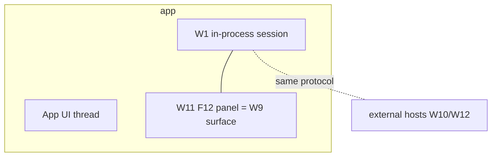

# Spec: the in-app DevTools window (W11)

> **Status:** 🟡 Draft v0.1 — the no-IDE host. An F12-style panel inside the running app.
> **Branch:** `winui-devex` · **Owner:** (you) · **Workstream:** W11
> **Related:** `winapp-devtools-designer.md` (W9, the surface it frames) · `winapp-run-inspect.md`
> (W1, the in-process daemon) · `winapp-devtools-read.md` (W3) · `winapp-devtools-selection.md` (W6).

---

## 1. Summary

W11 is the **in-app DevTools window**: a browser-style **F12 panel hosted inside the running app's own
process**, showing the visual tree, property grid, and selection — with **no external IDE required**.

It is the fastest path to a *visible* v1, because the engine is **already in-process**: the design-time
session attaches to the app's UI, so surfacing a window there adds no new transport and no separate
tool. It's also the best **demo** and the natural **fallback** for developers who aren't in VS Code —
attach, pop the panel, inspect, tweak.

Like every client, W11 frames the **W9 surface** and speaks the **one protocol**; it holds no
diagnostics logic of its own. Its distinguishing property is *where* it runs: co-located with the app,
on the app's UI thread discipline (owned by W1).

---

## 2. Goals & non-goals

| ID | Goal |
|----|------|
| **G1** | Host the W9 surface (tree + property grid + selection) **inside the running app**, toggled like an F12 panel. |
| **G2** | Require **no external IDE** — attach + inspect + tier-1 edit stand alone. |
| **G3** | Respect the **threading contract** (W1): render on the app UI thread; never block it. |
| **G4** | Be **opt-in / dev-only** — present only for an attached design-time session, never in a shipping app by default. |
| **G5** | Reuse the W9 surface + protocol unchanged (thin host). |

**Non-goals**
- **No always-on presence in production** — the window exists for an attached dev session only.
- **No engine logic** — thin host over the in-process daemon.
- **No v1 structural/persist** — inherits W9's v1 scope.

---

## 3. Why in-app is cheap here

The design-time session (W1) attaches to the app and already runs **inside the process**, on the UI
dispatcher discipline. So an in-app window is not a new mechanism — it's the **same session** surfacing a
view locally instead of shipping data to an external host:

This makes W11 a strong **first host to ship**: it proves the whole read→select→tune loop with the
fewest moving parts (no IDE, no cross-process client), which is why it's a candidate to carry the v1
read surface alongside — or ahead of — VS Code.

---

## 4. Hosting & safety

- **Opt-in surface.** The panel appears only when a design-time session is attached (dev-time, Debug,
  Developer Mode). It is not compiled into or auto-shown in a shipping build.
- **Threading.** All rendering and mutation obey the W1 dispatcher discipline; the panel must never
  block the app UI thread while enumerating or applying.
- **Non-invasive selection.** The overlay uses the W6 out-of-process-safe, non-destructive highlight so
  inspecting doesn't perturb the app's own layout/state.

---

## 5. Backward compatibility & the standing gate

W11 is new and dev-only; it changes no shipping behavior.

**Standing W11 gate:** an **in-app round-trip** on the live fixture — attach, open the panel, render the
tree + properties, select both directions, edit a property value, and confirm the app UI thread stays
responsive (no deadlock, no jank) and the outcome is reported honestly. Responsiveness is the
load-bearing assertion, since W11 shares the app's UI thread.

**Testing:** live-fixture smoke with the panel toggled; a UI-responsiveness/no-deadlock assertion under
enumeration + apply load.

---

## 6. Decisions & open questions

**Resolved:** in-app F12 host, dev-only/opt-in, thin host over the in-process session, inherits W9 v1
scope, obeys W1 threading.

**Open:**
- **Q-INAPP-DELIVERY — how the panel gets into the app:** surfaced by the attached session vs a
  referenced dev-only component. Baseline: surfaced by the attached session so no app code change is
  needed to inspect.
- **Q-INAPP-FIRST — is W11 the v1 read host** (ahead of W10)? It has the fewest dependencies. Baseline:
  strong candidate for the first visible milestone; decide with W10 at M1.
- **Q-ISOLATION — keeping the panel's own UI** from being enumerated as part of the app's tree (avoid
  self-inspection noise).

## 7. Rough implementation phases

1. **Panel shell.** Toggleable in-app window that frames the W9 read surface.
2. **Selection + provenance.** Two-way pick via W6; confidence badge via W4.
3. **Tune.** Tier-1 property editing with honest outcomes.
4. **Hardening.** UI-thread responsiveness + self-inspection isolation.

## Appendix — the no-IDE demo

W11 is the "attach and it's just there" host: the smallest possible path from a running app to a live,
honest inspect/tune loop.
