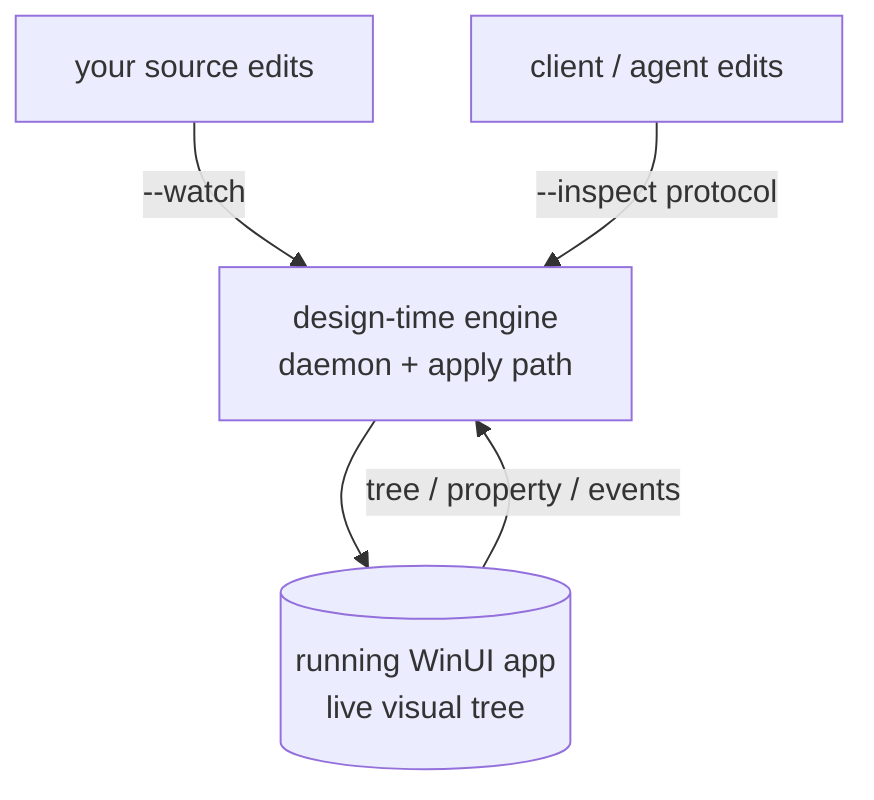

# Spec: WinUI design-time DevTools for `winapp` — overview & workstream map

> **Status:** 🟡 Draft v0.5 — umbrella / north-star. Living document, iterate freely.
> **Branch:** `winui-devex` · **Owner:** (you) · **Author of draft:** Copilot
> **Related:** `winapp-devtools-protocol.md` (the contract). A working proof-of-concept validates the
> mechanism end-to-end (live tree read, property read/edit, and XAML **and** C# hot-reload apply on a
> running WinUI app).
>
> **What this document is.** The single "read-me-first" for the design-time DevTools effort. It states
> the problem, shows where the work fits in `winapp`, sketches the architecture, and **indexes the
> per-workstream specs** so multiple people/agents can each own one. It does **not** re-specify any
> single feature — each has its own spec (see §9).
>
> **v0.5 changes:** made the **designer ↔ protocol** relationship explicit and added the missing engine.
> The designer is the **editing experience** layered over a **live WinUI instance**, reached by **two
> front doors** — *attach* (your running app, W1) or *preview* (a **preview host** over a single **file**,
> the new **W13 rendering engine**). Split the two transports: the **protocol** carries **data**; a
> separate **render transport** (W13) carries **pixels** into the panel. Attach-mode designer rides the
> inspect stack (ships first); preview-mode is gated on W13.
> **v0.4 changes:** **Visual Studio (W12) is now a first-class v1 host, not "later / kill-gated"** — it
> sits **beside VS Code** in the main plan, and its headline value is the **designer** (the live
> authoring surface the WinUI community ranks a **top-priority ask**). Designer **authoring** (structural
> edits + save-to-XAML) is the **immediate next priority** after v1 property-editing — gated on the W4
> census + W8 consent, **not deferred**.
> **v0.3 changes:** split the client layer into **per-surface workstreams** (W7 CLI · W9 the shared
> **visualizer→designer** surface · W10 VS Code · W11 in-app window · W12 VS) so each is independently
> ownable; made the **designer = visualizer-evolved** relationship explicit (§4/§6). **CLI-first:**
> the CLI's `--json` surface is the agent contract (no separate agent-integration layer in scope
> initially), and because clients are
> generated from one schema, another client can be added later without protocol change.
> **v0.2 changes:** elevated **hot reload** / **`winapp run --watch`** to a co-equal pillar next to
> inspect; added the surfaces and where **annotations** live; scoped the document to publicly-shareable
> information.

---

## 1. Summary

Give `winapp` a **XAML-runtime-native inspect + edit surface** for WinUI 3 apps, exposed two ways:

- **Hot reload — `winapp run --watch`:** edit your source and see it live in the running app —
  **XAML *and* C#** — from any editor, no debugger required.
- **Live inspect — `winapp run --inspect`:** attach to the running app, read its **live visual tree**
  and **dependency-property values**, select/annotate elements, and apply targeted edits —
  programmatically, so humans **and AI agents** can drive it.

Both are powered by one engine and one documented protocol, and both are **IDE-agnostic** (CLI, VS
Code, Visual Studio, or an in-app DevTools window — no single IDE required). This is the capability
WinUI developers ask for that exists today only in a limited, IDE-locked form.

It also complements what `winapp` already has: **`winapp ui *`** drives apps through **UI Automation
(UIA)** — the accessibility tree, a black-box view. The DevTools surface is its **XAML-native peer**:
where `ui` sees the automation tree, DevTools sees the **actual visual tree** and can hot-reload it.

---

## 2. Motivation & current state (the honest problem statement)

**Hot reload for WinUI exists today, but only in a limited, locked-down form:**

| Tool | What it gives | Where it stops |
|---|---|---|
| **Visual Studio XAML Hot Reload** | Live XAML edits while debugging from VS. | **XAML only** (C# hot reload is far more limited), **tied to the VS debugger**, and developers routinely ask for it to be more capable. Not available to the CLI, VS Code, or agents. |
| **VS Live Visual Tree / Property Explorer** | Inspect the XAML tree **inside VS** while debugging. | VS-only, debugger-attached, human-only, read-mostly. No programmatic/agent surface. |
| **`winapp ui *`** (this repo) | Cross-process **UIA** automation: click/search/get-value/screenshot/inspect the **accessibility** tree. | Not the XAML tree. No dependency-property value-source, no resource/binding introspection, no live XAML/C# edit. |
| **AI coding agents** | Can edit source and drive UIA via `winapp ui`. | **Cannot see or touch the live XAML tree.** They edit blind, re-run, and screenshot to guess whether it worked. |

**The gap.** There is no **IDE-agnostic, programmatic, agent-consumable** way to hot-reload and inspect
a running WinUI app's *actual XAML tree* — the thing developers and agents most need for inner-loop UI
work. VS solves a slice (XAML hot reload) but only inside VS and only for XAML.

**Why `winapp` is the right home.** `winapp` already builds and launches WinUI apps and already
automates them (`ui`). Adding a XAML-native hot-reload + inspect surface here makes it a first-class,
tool-agnostic capability: a `--watch` loop in the terminal, a scriptable/agent-drivable protocol, and
a surface VS Code / Visual Studio / an in-app window can all consume — without requiring a specific
IDE's debugger.

**This is grounded, not speculative.** A working proof-of-concept has already demonstrated the
mechanism end-to-end on a live WinUI app: attaching the diagnostics service, enumerating the tree,
reading properties with value-source precedence, and applying **both XAML and C#** edits to a running
instance. This spec set turns that proof-of-concept into production `winapp` components.

---

## 3. The developer surface: two modes on `winapp run`

Both modes are **new flags on the existing `winapp run`** (which already launches folder- and — soon —
`.csproj`-mode apps; see `winapp-run-csproj.md`). They share one engine and compose freely.

| Mode | Flag | Who drives edits | What it does |
|---|---|---|---|
| **Hot reload** | `winapp run --watch` | **your source files** | Watches the project, rebuilds/re-applies changes to the running app live (XAML + C#), reporting an honest per-edit outcome (applied / applied-but-inert / needs-reload / needs-restart). |
| **Live inspect** | `winapp run --inspect` | **clients & agents** | Hosts the resident daemon and exposes the live tree + property + edit + select/annotate surface over the protocol, for any client to read and drive. |

- **They combine:** `winapp run --inspect --watch` gives you both — a file-driven hot-reload loop **and**
  a live client/agent surface over the same running instance and the same apply path.
- **One apply path, two drivers.** `--watch` is the *source-driven* driver of the mutation engine;
  `--inspect` is the *client-driven* driver. Both go through the same daemon, so an edit from a file
  save and an edit from an agent are classified and reported identically.

---

## 4. The surfaces (one protocol, many hosts)

The whole point of a documented protocol is that **many hosts** can drive the same engine. Each is its
own workstream (see §8):

| Surface | Host | Role |
|---|---|---|
| **CLI** (`winapp`) | terminal | Text / **`--json`** inspect + edit — the contract humans script against and **AI agents drive directly** (structured access to the live tree, not screenshots). *(W7)* |
| **Designer** | VS Code · in-app · VS | The **editing experience**: a live visual-tree view + property grid + overlay, over **two front doors** — *attach* (your running app, W1) or *preview* (a host over one **file**, W13). The **visualizer → designer** gradient: read-only inspect that *evolves into* live editing (see §6). *(W9)* |
| **VS Code extension** | VS Code | A **first-class IDE host** of the designer surface (beside Visual Studio): inspect + hot reload inside the editor. *(W10)* |
| **In-app DevTools window** | the running app | An **F12-style** panel hosted **inside the app** — inspect and edit with no external tool at all. *(W11)* |
| **Visual Studio designer** | Visual Studio | A **first-class v1 host** whose headline value is the **designer** — the live authoring surface the community ranks a **top-priority ask**; existing VS users get inspect + the designer without leaving VS. *(W12)* |

All hosts speak the **same protocol** (`winapp-devtools-protocol.md`); none is privileged. The engine is
the durable thing; hosts are thin — and because the CLI facade is **generated from one schema**, new
programmatic clients can be added cheaply as needs emerge.

**Designer = visualizer, evolved.** The visual surface isn't a separate product from "inspect": it's the
same tree + property view with write capabilities progressively enabled — inspect (read) → set property
(mutate) → structural edits → persist to source. That gradient maps 1:1 onto the protocol's **risk
tiers** (§6, W2), so one surface spans the whole range instead of two disjoint tools.

---

## 5. Architecture at a glance

Four layers, each an ownable workstream:

1. **Attach + host (W1), + the render substrate (W13).** `run --inspect`/`--watch` attaches the
   diagnostics service to the target and hosts a **resident daemon** — the session broker that holds the
   diagnostics interface, a handle table with generation stamps, and the UI dispatcher **across calls**
   (a stateless per-call CLI cannot hold live object identity — the proof-of-concept confirmed a
   persistent broker is required). A live tree can also come from the **preview host (W13)** — a tiny
   unpackaged WinUI process that loads a **single XAML file** and renders it — so the designer works with
   **no app of yours running**. Both present the *same* protocol.
2. **Contract (W2).** The protocol: JSON-RPC framing over a per-user pipe, capability negotiation,
   typed commands/events, cancellation, structured errors. One hand-authored schema; the CLI facade is
   **generated** from it (further clients generable the same way).
3. **Capabilities (W3–W6).** The read floor (tree/property/resource), hot-reload/apply, and
   selection/annotation overlay — each a normative protocol capability family with its own spec.
4. **Surfaces + trust (W7, W9–W12, W8).** The CLI facade, the shared **designer** surface and its
   VS Code / in-app / VS hosts, and the security/durability model that gates packaged & enterprise
   claims.

**The mechanism (publicly-known parts).** The engine drives WinUI's **Visual Diagnostics** surface —
the same runtime facility behind Live Visual Tree and XAML Hot Reload — through the public Windows SDK
diagnostics interfaces (`IVisualTreeService3` / `IXamlDiagnostics`, declared in the SDK header
`xamlOM.h`). The **threading discipline is load-bearing**: the site is bound on the app's UI thread;
enumeration runs on a worker with interfaces marshaled through the Global Interface Table and an agile
callback; **all mutations run back on the UI thread** via the app's dispatcher. Getting this wrong
deadlocks or fails with a cross-thread COM error — so the daemon owns it once, for every client.

---

## 6. What clients can do with the live tree (capability families)

The protocol turns "drive the live visual tree" into concrete, uniform operations — so annotations and
edits aren't bolted-on one-offs but families alongside read:

| Family | Operations | Risk |
|---|---|---|
| **VisualTree** | enumerate / subscribe / search the live tree; resolve handles. | read |
| **Property** | get a dependency property **with value-source precedence**; set (preview / commit). | read → mutate |
| **Resource** | resolve `{ThemeResource}` / `{StaticResource}` values. | read |
| **HotReload** | apply XAML + C# edits (plan / preview / commit / rollback) with an honest outcome. | structural → persist |
| **Selection & annotation** | highlight / pick an element; **annotate** it (labels/callouts on the live UI); **clear annotations**. | mutate-ephemeral |
| **Source** | best-effort element→source mapping, **confidence-graded** (see §7). | read |
| **Diagnostics** | structured reason-codes + a diagnostics event stream. | read |
| **Security** | consent, capability grants, audit (see W8). | privileged |

**Annotations** live in the **Selection & annotation** family (W6): the same out-of-process overlay
that highlights a picked element can draw labeled annotations on the live UI and clear them — driven
through the protocol like everything else, so a CLI, VS Code, or an agent can all annotate/clear
uniformly.

---

## 7. The capability floor vs. best-effort (a settled policy)

An honesty-first contract every spec must uphold:

- **Guaranteed floor:** **visual-tree enumeration + dependency-property reads** (with value-source
  precedence) + resource resolution. Config-independent (**identical in Debug and Release**). "XAML
  sight, day one." (W3)
- **Confidence-graded, best-effort:** **element→source mapping** ("select-to-source"). Source line
  info is compiler-emitted, config-gated, **stripped in Release**, and absent for
  templated/virtualized/`{x:Bind}`-function elements — so it is a **confidence-graded** capability over
  the floor, with a **false-confident prohibition** (never claim a source it doesn't have). A pre-build
  **census** measures the real rates before this is trusted. (W4)
- **The four-outcome honesty invariant** for every mutation (hot reload included): `applied` /
  `applied-inert` / `reloaded` / `needs-restart`. The engine **never claims a success it cannot
  guarantee** — the difference between a tool an agent can trust and one that lies to it. (W5)

---

## 8. Workstream → spec map

Each workstream is **independently ownable** (its own spec, PR, and validation gate). Critical path:
**W1 → W2 → {W3, W7} → W9 → {W10, W11, W12}** (VS Code, in-app, and Visual Studio are peer hosts);
**W13 (rendering engine)** feeds W9's **preview** front door; W4/W8 harnesses run in parallel as the
pre-build reality probe.

| WS | Spec file | Scope (one line) | Surfaces as | Gate |
|----|-----------|------------------|-------------|------|
| **W1** | `winapp-run-inspect.md` | Attach + resident daemon / session broker. | `run --inspect` / `--watch` host | latency + identity persistence |
| **W2** | `winapp-devtools-protocol.md` | Protocol schema + normative contracts (**proto built**). | the contract | additive: change ≤1 surface |
| **W3** | `winapp-devtools-read.md` | Visual-tree + property + resource **read floor**. | inspect | config-independent (Debug=Release) |
| **W4** | `winapp-devtools-provenance.md` | Confidence-graded source/identity + **census**. | select-to-source | resolution rate; false-confident → KILL |
| **W5** | `winapp-devtools-hot-reload.md` | Mutation/apply + transaction taxonomy. | **`run --watch`** + client edits | differentiated packaged-reload slice |
| **W6** | `winapp-devtools-selection.md` | Out-of-proc selection + **annotation** overlay. | select / annotate / clear | overlay never forces layout / lags >1 frame |
| **W7** | `winapp-devtools-cli.md` | CLI-JSON facade — the **client-driven** inspect + tune surface (terminal host). | CLI | `--json` payloads schema-valid |
| **W8** | `winapp-devtools-security.md` | Trust model + packaged durability + EDR. | all surfaces | EDR-survival · security · SDK-treadmill |
| **W9** | `winapp-devtools-designer.md` | The shared **visualizer→designer** visual surface (read→edit gradient). | the visual surface (hosted) | edit round-trip · designer bakeoff |
| **W10** | `winapp-devtools-vscode.md` | VS Code extension — **first-class IDE host** of the designer surface (beside VS). | VS Code | in-editor inspect + hot reload |
| **W11** | `winapp-devtools-inapp-window.md` | In-app **F12-style** DevTools window. | in-app window | zero-external-tool inspect/edit |
| **W12** | `winapp-devtools-visual-studio.md` | **Visual Studio designer host** — the top-ask authoring surface; **first-class v1** (beside VS Code). | Visual Studio | designer inspect + edit round-trip |
| **W13** | `winapp-devtools-preview-host.md` | **Rendering engine / preview host** — render one XAML **file** (no app of yours running) + stream pixels; the designer's **preview** front door. | preview substrate | render round-trip: file → tree-over-protocol + pixels; live re-render on save |

**Milestones:** **M0** pre-build probe + decisions · **M1** inspect + hot-reload core + the **read
designer hosted in Visual Studio (W12) and VS Code (W10)** together (plus in-app W11) —
W1/W2/W3/W5-slice/W6/W7 + W9-read · **M2** designer **property editing** (W9 tune) across VS + VS Code +
the W5 apply engine · **M3 — the headline:** **full designer authoring** (structural + save-to-XAML,
W9 compose/persist) — the community's top ask and the **immediate next priority**, gated on the W4
census + W8 consent; enterprise/durability (W8) hardens alongside.

**Front-door phasing (attach vs preview).** M1–M2 run on the **attach** door — the designer edits your
*running* app, riding the inspect stack with **no new render engine**. The **preview** door — designing a
**file** with no app of yours running — is gated on the **W13 rendering engine**, a distinct and harder
track; it lands when W13 matures (target M3, alongside full authoring). This keeps the hard rendering
work off the critical path for early designer value while still committing to the file-focused designer
the community pictures.

---

## 9. The spec set (index)

Read in this order.

**The engine & contract**

1. **`winapp-devtools-overview.md`** — *this document.* The map.
2. **`winapp-devtools-protocol.md`** *(W2 — the contract)* — framing, capability families, the
   normative enums (value-source precedence, source-kind states, transaction taxonomy, the four-outcome
   classifier, risk tiers), and how the CLI facade is generated. **Everything binds to this.**
3. **`winapp-run-inspect.md`** *(W1 — entry point)* — `winapp run --inspect` / `--watch`: attach, the
   resident daemon, session/attach/detach/reconnect, the handle+generation model.
4. **`winapp-devtools-read.md`** *(W3 — the floor)* — enumerate/subscribe/search; property get with
   value-source; resource resolve; honest incompleteness for popups/virtualized/templated subtrees.
5. **`winapp-devtools-hot-reload.md`** *(W5 — hot reload)* — the `--watch` loop + client-driven
   set/preview/commit/rollback; XAML + C# apply; the transaction taxonomy; the four-outcome invariant.
6. **`winapp-devtools-selection.md`** *(W6 — selection + annotation)* — transparent click-through
   overlay for highlight/pick **and** annotate/clear; multi-monitor / high-DPI; inert fallback.
7. **`winapp-devtools-provenance.md`** *(W4 — provenance + census)* — confidence-graded
   select-to-source; the multi-config census that runs the cheapest pre-build falsifier.
8. **`winapp-devtools-security.md`** *(W8 — trust)* — pipe ACLs + session tokens + capability grants +
   audit; the EDR + self-contained + ARM64 + soak durability matrix; the SDK-treadmill CI gate.
9. **`winapp-devtools-preview-host.md`** *(W13 — rendering engine)* — the preview host: render one XAML
   **file** with no app of yours running; expose its live tree over the protocol; **stream** its pixels;
   the designer's **preview** front door. One of the two genuinely-new engines.

**The surfaces (hosts of the engine)**

10. **`winapp-devtools-cli.md`** *(W7 — CLI facade)* — the **client-driven** inspect + tune surface;
    `--json` is the agent contract; source-driven hot reload stays on `run --watch` (not a verb); the
    persistent-session rule; the terminal host of the surface.
11. **`winapp-devtools-designer.md`** *(W9 — the editing experience)* — the surface layered over a live
    instance via **two front doors** (attach: your app · preview: a host over one file, W13): read→edit
    capability gradient, effective-value grid, source-confidence badges; the contract the visual hosts
    render.
12. **`winapp-devtools-vscode.md`** *(W10 — VS Code host)* — the `winapp` VS Code extension: a
    first-class IDE host (beside Visual Studio) for inspect + hot reload.
13. **`winapp-devtools-inapp-window.md`** *(W11 — in-app host)* — the F12-style DevTools window hosted
    inside the running app.
14. **`winapp-devtools-visual-studio.md`** *(W12 — VS designer host, v1)* — the Visual Studio host whose
    headline value is the **designer**, the community's top-priority ask; first-class, beside VS Code.

---

## 10. Gates, milestones & the strategic fork

**Standing validation gates** (each spec owns one or more; a change isn't done until its gate is
green):

| Gate | What it proves | Owner |
|---|---|---|
| **Source-resolution** | Select-to-source rate on real Release/packaged/trimmed apps (the cheapest falsifier). | W4 |
| **Session latency/identity** | Daemon **<50 ms/call** + live object identity persists across calls/invocations. | W1 |
| **Single-surface evolution** | A schema field-add flows to **every generated facade** with **≤1** hand-edited surface. | W2/W7 |
| **Durability & trust** | EDR-survival · security-model · SDK-servicing-treadmill. | W8 |
| **Adoption** | Designer edit round-trip · **Visual Studio + VS Code** / in-app host adoption · differentiated packaged-reload slice. | W9/W10/W12/W5 |
| **Render round-trip** | A representative XAML **file** renders in the preview host, its tree reads over the protocol, and pixels stream into a panel; live re-render on save. | W13 |

**Pre-build decisions the human owns** (see §12): the **strategic fork** and the **demand gate**.
Nothing expensive (the full-scope mutation engine) is funded until the pre-build probe + these pass.

**A proof-of-concept smoke suite is the regression truth** while production code lands: each component
maps to named smoke checks the proof-of-concept already proves; a red check blocks the PR.

---

## 11. Conventions for spec authors

- **House format.** Follow `winapp-run-csproj.md`: versioned status header; numbered sections
  (Summary → Goals/non-goals → Current behavior → Terminology → CLI UX → design → compatibility →
  testing → decisions/open questions → implementation phases → appendix of code-to-reuse). Prefer
  tables, `mermaid`, and **requirement IDs** (`G#`) + **question IDs** (`Q#`).
- **Empirically grounded, not selly.** Describe the problem and the solution; cite proven behavior from
  the proof-of-concept. No marketing.
- **Public-appropriate.** Write for an external reader: only include information a reader outside the
  team would have access to (public SDK surfaces, documented behavior, our own findings). Don't lean on
  internal repo names or internal-only artifacts.
- **Bind to the protocol, not a verb.** CLI command naming (§12) is open; specs describe capability
  families and their protocol contracts and treat the surfaced verb as a thin, swappable facade.
- **Reuse `winapp` services.** Like the csproj spec, name the existing services to reuse
  (`RunCommand`, `AppLauncherService`, `ProjectDetectionService`, `MsixService`, the `ui` UIA
  infrastructure) rather than reinventing.
- **One issue → one PR.** Stay in the spec's scope; note follow-ups instead of widening.

---

## 12. Decisions & open questions

**Resolved (specs assume these):**
- The durable thing is a **daemon**; the CLI + IDE + in-app clients are **thin clients** over
  it (no stateless per-call path).
- **Read floor is guaranteed; select-to-source is confidence-graded best-effort** with a
  false-confident prohibition.
- One **CDP-shaped** protocol; the CLI facade is **generated** from it, and further clients can be
  generated the same way.
- **Four-outcome** mutation honesty invariant (applies to `--watch` hot reload and client edits alike).

**Open — need a human decision:**
- **Q-NAME — the CLI surface.** Do the design-time verbs live under `winapp ui` (a XAML mode next to the
  UIA mode), a new **`winapp inspect`**, or a **`winapp devtools`** namespace? *(Flagged as undecided;
  specs are written to not depend on the answer. Recommendation deferred until the inspect surface lands
  and the ergonomics are concrete.)*
- **Q-FORK — the strategic fork.** Ship a **standalone engine** vs. an **upstream-adoptable contract**
  the WinUI platform could absorb. Leaning contract-first. Changes which workstream leads, not the
  foundations. Needed at branch-planning time.
- **Q-DEMAND — the demand/funding gate.** Measured demand + a platform-roadmap probe before funding the
  full mutation engine (W5).

---

## 13. Glossary

- **The engine / daemon** — the resident session broker (`run --inspect`/`--watch` hosts it) that holds
  the diagnostics interface + handle table + UI dispatcher across calls.
- **Hot reload (`--watch`)** — the source-driven live-edit loop: edit source, see it live (XAML + C#).
- **Live inspect (`--inspect`)** — the client/agent-driven live tree + property + edit + annotate
  surface over the protocol.
- **The floor** — the guaranteed, config-independent read surface (tree + property + resource).
- **Annotations** — labeled markers/callouts drawn on the live UI via the selection/overlay family;
  addable and clearable through the protocol.
- **Select-to-source / provenance** — element→source-location mapping; best-effort, confidence-graded.
- **Value-source precedence** — *where* a property value came from (local → animation → template →
  style → resource → inherited → default).
- **The four outcomes** — `applied` / `applied-inert` / `reloaded` / `needs-restart`.
