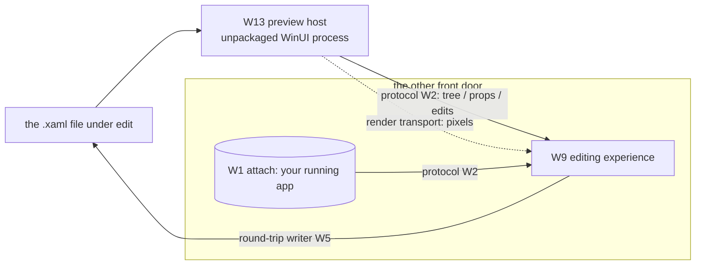

# Spec: the rendering engine — preview host (W13)

> **Status:** 🟡 Draft v0.1 — the engine that renders a XAML **file** with no app of yours running.
> **Branch:** `winui-devex` · **Owner:** (you) · **Workstream:** W13
> **Related — the other substrate:** `winapp-run-inspect.md` (W1 — the **attach** front door: *your*
> running app; W13 is its "no-app-of-yours" sibling). **What it reuses:**
> `winapp-devtools-protocol.md` (W2 — the tree is read/mutated over this) · `winapp-devtools-read.md`
> (W3) · `winapp-devtools-selection.md` (W6) · `winapp-devtools-hot-reload.md` (W5 — `--watch`
> re-render + the round-trip writer). **What sits on top:** `winapp-devtools-designer.md` (W9 — the
> editing experience). **Trust:** `winapp-devtools-security.md` (W8 — isolation, packaged).

---

## 1. Summary

W13 is the **rendering engine**: a small **unpackaged WinUI host process** that loads a **single XAML
file** — plus the custom types, resources, and converters it references — and **renders it live**. It
produces the two things the designer's *preview* mode needs:

1. a **live visual tree** — exposed over the **same inject + protocol** as a running app, so W3 read,
   W6 selection, and W5 apply all work **unchanged**; and
2. a **rendered pixel stream** the design surface embeds in an IDE panel — the **render transport**,
   which is **distinct from the protocol** (the protocol carries data, not pixels).

This is what turns *"design a file with **no app of mine running**"* into *"a **host** runs instead."*
Of the two genuinely-new engines the design-time system needs, W13 is one — the other, the **round-trip
writer** (visual → source), lives in W5's persist tier.

**Grounded vs proposed (honest):** the inspect surface it exposes rides the **proven** inject+protocol
core. The **host bring-up** — resolving an arbitrary file's types/resources, the pixel transport,
`--watch` re-render — is **new engineering and the hard part**, which is exactly why it's its own
workstream rather than a detail buried in the designer.

---

## 2. Goals & non-goals

| ID | Goal |
|----|------|
| **G1** | Load & instantiate a single file's XAML into a **real WinUI object tree** inside a host process (a live instance, not a parsed source model). |
| **G2** | Expose that tree over the **same inject + protocol** as a running app, so the surface reuses W3/W6/W5 with **no designer-specific engine**. |
| **G3** | **Stream** the rendered output to an embedding surface (the render/pixel transport), so the UI shows **inside** an IDE panel. |
| **G4** | Stay **resident under `--watch`**: re-render on file save (source-driven) and reflect client mutations (client-driven), both through the W5 apply engine. |
| **G5** | **Isolate:** user types/assemblies load into the **host**, never the IDE process — crash isolation + the W8 trust model. |
| **G6** | Resolve as much of a real file's **dependencies** (custom controls, converters, merged `ResourceDictionary`, theme/DPI, design-data) as practical, and **fail honestly** ("can't render X") for the rest. |

**Non-goals**
- **No "render any XAML cold, with no host"** (true design-time render) — the fragile old-VS-designer
  path; an explicit non-goal. We scope to the **preview-host** path.
- **No editing UX** — the property grid, tree gestures, and overlays are **W9**.
- **No protocol of its own** — W13 reuses W2/W1's protocol; it defines none.
- **No persist-to-source** — the round-trip writer is **W5**.
- **No attach to *your* app** — that's **W1**, the other front door.

---

## 3. Where W13 sits — the two front doors to a live tree

A live, inspectable WinUI tree can come from **two substrates**; W9's surface is identical over either:

| Front door | Substrate | Whose process | Render transport? |
|---|---|---|---|
| **Attach** | W1 `run --inspect` | **your** running app | **no** — your app is on screen; overlay draws in place (W6) |
| **Preview** | **W13 preview host** | a **host** loading one **file** | **yes** — host pixels stream into the IDE panel |

So W13 is, precisely, *"**W1**, but the process is a **generated host over a file**."* Once it's up, it
is a running WinUI app; the only honesty caveat is that **your** app isn't running — a stand-in is.

---

## 4. The two transports (why the protocol isn't the whole story)

| Transport | Carries | Owner | Used by |
|---|---|---|---|
| **Protocol** (W2) | **data** — tree, properties w/ value-source, mutations, events | W1/W2 | every surface (attach **and** preview) |
| **Render transport** | **pixels** — the host's rendered output | **W13** | the **preview** front door only |

W13 **owns the pixel side**; the surface (W9) composites the protocol-driven tree/grid/overlay **over**
the streamed pixels. The protocol carries **no pixels**; the render transport carries **no tree data**.
Keeping them separate is what lets the *same* protocol serve attach-mode (no pixels) and preview-mode
(pixels) without change.

---

## 5. Hazards (why this is genuinely hard — and its own workstream)

- **Dependency resolution.** A real file drags in app types, custom controls, converters, merged
  resource dictionaries, styles. v1 scopes to what resolves; **honest "can't render"** for the rest
  (**Q-RENDER-SCOPE**).
- **Design-data / theme / DPI.** No live data source and no ambient app; the host needs design-time
  data + a theme/DPI selection to render meaningfully.
- **The writer ↔ watcher loop.** Designer writes source → `--watch` sees it → re-render → flicker / lost
  state / loops. Needs "this edit came from us" suppression, **co-designed with W5** — not bolted on.
- **Pixel-transport fidelity.** Getting host pixels into a foreign panel (swapchain/composition capture)
  across DPI, resize, and input routing (**Q-PIXEL-TRANSPORT**).
- **Isolation & packaged.** The host runs **unpackaged** first (the proven configuration); packaged /
  isolated hosting is a **W8** gate, not free.

---

## 6. Backward compatibility & the standing gate

New engine; changes nothing existing.

**Standing W13 gate — the render round-trip:** load a representative fixture **file** → the host renders
it → the surface reads its tree **over the protocol** *and* the pixels appear in an **embedding panel** →
a **file save re-renders live** under `--watch`. The gate **fails** if the host loads user code into the
IDE process, or renders without exposing an inspectable tree.

**Testing:** a fixture-file corpus (trivial controls → app-resource-heavy → custom-control) with golden
"renders? tree-complete? honest-failure?" expectations.

---

## 7. Decisions & open questions

**Resolved:** the preview host is its **own workstream** (rendering ≠ editing); it reuses the
inject+protocol core so the surface is substrate-agnostic; **true cold render is a non-goal**; the
round-trip writer stays in W5.

**Open:**
- **Q-RENDER-SCOPE — how much dependency resolution v1 targets** (bare controls only? app resources?
  custom controls?) and how failure is surfaced. Baseline: resolve-what-you-can + honest per-node
  "unrenderable."
- **Q-PIXEL-TRANSPORT — the mechanism** to get host pixels into an IDE panel (swapchain handle share ·
  composition capture · other), across DPI/resize/input.
- **Q-HOST-LIFECYCLE — one host per file vs a reused host;** crash isolation & restart; how the surface
  addresses the host session (ties to W1's session model).
- **Q-FRONT-DOOR-PHASING — does v1 designer ship attach-mode first** (rides W1 inspect, no W13) with
  **preview-mode gated on W13**? Baseline: yes (see overview milestones).

## 8. Rough implementation phases

1. **Render trivial.** Load a bare-controls file in an unpackaged host; expose its tree over the protocol.
2. **Resolve real files.** App resources / types / converters; honest failure for the rest.
3. **Pixel transport.** Stream the host's output into one embedding panel (e.g. W11 in-app, or a probe).
4. **Live re-render.** `--watch` re-render + writer↔watcher suppression (with W5).
5. **Hand off to W9.** The surface composites grid/tree/overlay over the stream and drives edits.

## Appendix — where W13 sits

