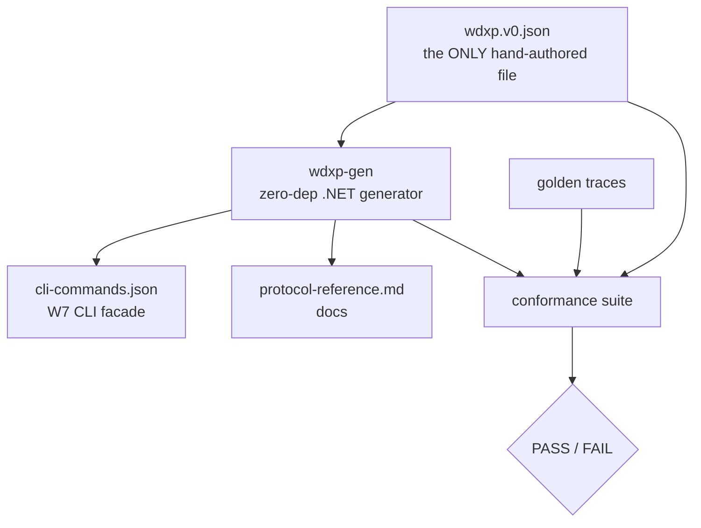

# Spec: WDXP — the WinUI Design-time eXperience Protocol (v0)

> **Status:** 🟢 Draft v0.1 — **the contract already exists and is conformance-green.** This spec is
> the spec-of-record for it and defines the production port.
> **Branch:** `winui-devex` · **Owner:** (you) · **Author of draft:** Copilot · **Workstream:** W2
> **Related:** `winapp-devtools-overview.md` (§ the map). A working proof-of-concept implements this
> contract end-to-end — the canonical schema, a generator that emits the CLI facade, a
> conformance suite, and golden traces — over a proven JSON-RPC transport.
>
> **Unusual for a spec:** W2 was **built first** (the schema, the generator, the conformance suite)
> because it is the shared contract every other workstream binds to — it had to be real before the
> others could start. As of this draft the suite reports **PASS (5/5)**: schema valid, Gate-3 facade
> totality, and three golden traces conform. This document formalizes what was built and states the
> rules for evolving it.

---

## 1. Summary

**WDXP** is the wire contract between the design-time daemon (`winapp-run-inspect.md`, W1) and every
client — the CLI-JSON facade, VS Code, and any visual client. It defines: JSON-RPC
framing over a per-user named pipe; capability negotiation; **typed commands + server events grouped
into capability families**; cancellation; a structured error taxonomy; and normative **value/state
enumerations** that encode the project's honesty guarantees.

There is **one hand-authored source of truth** — `wdxp.v0.json` — and the CLI surface is
**generated** from it (DAP/LSP-style). Adding a command or field touches exactly **one** file and
flows to both facades automatically (this is **Gate 3**, and the conformance suite asserts it).

**Why a protocol at all, and why CDP-shaped.** The debate rejected a bespoke wire and a stateless
per-call CLI. A documented, capability-negotiated, JSON-RPC protocol is what makes the surface
**IDE-agnostic and adoptable** — VS Code, a visual client, or the WinUI platform itself can implement
or consume it. Chrome DevTools Protocol, LSP, and DAP are the precedents; WDXP follows their proven
shape (language-neutral JSON contract → generated facades), not their DSLs.

---

## 2. Goals & non-goals

### Goals (mapped to requirements)

| # | Requirement | How WDXP addresses it |
|---|-------------|------------------------|
| **G1** | One contract, many clients | JSON-RPC families in `wdxp.v0.json`; the CLI facade **generated** from it (further clients generable the same way); a client is conformant iff it round-trips the golden traces. |
| **G2** | Single-surface evolution (no double-maintenance) | The generator walks the model generically; a field-add needs **≤1** hand-edit. Enforced by **Gate 3** (`gate3-facade-totality`). |
| **G3** | Encode the honesty guarantees as **API, not prose** | Normative enums: value-source precedence, source-kind states (incl. a false-confident prohibition), the extended transaction taxonomy, the four-outcome classifier, diagnostics reason-codes, and command **risk tiers**. |
| **G4** | Persistent session semantics | `session = connection`; capability negotiation per-connection; handles carry generation stamps; cancellation is first-class. |
| **G5** | Grounded in a proven substrate | Framing **is** the proof-of-concept transport (newline-delimited JSON-RPC 2.0 + server notifications over a per-user pipe) — not a new, unproven wire. |

### Non-goals

- **Not** the family *implementations* — those are W3 (read), W5 (hot-reload), W6 (selection), W4
  (provenance), W8 (security). This spec defines their **contracts**; the implementations have their
  own specs and must conform.
- **Not** the clients — CLI wiring is W7 (`winapp-devtools-clients.md`); this spec defines what
  they are generated *from*.
- **Not** a general-purpose RPC framework. WDXP is scoped to WinUI design-time inspection + edit.
- **Not** a stable v1. v0 is `experimental`; the shapes may still move under the versioning policy (§9).

---

## 3. Current behavior — the proven substrate this formalizes

WDXP does not invent a transport. It formalizes a **proof-of-concept transport** that already
round-trips end-to-end:

- **Newline-delimited JSON-RPC 2.0** over a **per-user named pipe** (`CurrentUserOnly`).
- **Requests → responses** *and* **server-initiated notifications** (the "an event happened" channel —
  e.g. `treeChanged`, `sessionEnded`).
- No WinUI dependency in the transport itself — it is a plain, length-agnostic framed channel.

The proof-of-concept's command vocabulary (find-by-name, children, get-child, get-property,
set-property, census, …) maps directly onto the first `VisualTree` / `Property` / `Source` families
defined here. WDXP is the **typed, negotiated, documented** generalization of that proven pipe, and
the proof-of-concept remains its non-regression oracle.

---

## 4. Terminology

- **Domain / capability family** — a named group of related commands + events (e.g. `VisualTree`,
  `HotReload`). Each domain has a `capability` id used in negotiation and facade naming.
- **Command** — a request/response method, `Domain.command` (e.g. `VisualTree.enumerate`).
- **Event** — a server-initiated notification, `Domain.event` (e.g. `Target.attached`).
- **Session = connection** — one pipe connection is one session; capabilities are negotiated on it;
  handles are valid only within it.
- **Handle + generation** — an opaque reference to a live tree node, stamped with a generation so a
  stale handle (after a tree change / redeploy) fails loudly rather than resolving wrong.
- **Facade** — a generated client surface (e.g. the CLI command graph). One schema can emit several.
- **Floor** — the guaranteed read capabilities (`VisualTree` + `Property` + `Resource`).
- **Outcome / risk tier** — protocol-level enumerations (§6) that every mutating command reports /
  is classified by.

---

## 5. The wire contract (envelope)

Full normative text: `envelope.md` (ports alongside this spec). Summary:

| Aspect | Contract |
|---|---|
| **Transport** | Newline-delimited UTF-8 JSON, one JSON-RPC 2.0 message per line, over a `CurrentUserOnly` named pipe. One connection = one session. |
| **Message shapes** | Standard JSON-RPC 2.0: request (`id`,`method`,`params`), response (`id`,`result`\|`error`), notification (`method`,`params`, no `id`). |
| **Negotiation** | First call is `WDXP.negotiate`: client sends protocol version + requested capabilities; server replies with supported capabilities + their stability. Unsupported capability → `CapabilityUnsupported (-32003)`. |
| **Cancellation** | `WDXP.cancel { id }` requests cancellation of an in-flight command; the cancelled command returns `Cancelled (-32008)`. |
| **Errors** | JSON-RPC standard codes + a WDXP-specific range (§6.4). Errors are **structured** (code + message + optional data), never free text an agent must parse. |
| **Security (framing-level)** | Same-user pipe; per-session grant; risk-tiered consent (W8 owns the full model — this spec exposes the tiers + `Unauthorized (-32004)`). |
| **Versioning** | `protocol`/`version` at the root; per-domain `stability`; additive-minor / breaking-major (§9). |

---

## 6. The capability families (the normative contract)

`wdxp.v0.json` v0.1.0: **10 domains · 32 commands · 8 events · 14 error codes · 5 risk tiers.** Each
domain is a normative contract an implementation workstream must satisfy.

| Domain | Capability | Cmds/Evts | Stability | Owner | Floor? |
|---|---|---|---|---|---|
| `WDXP` | `core` | 2 / 1 | stable | W1/W2 | — |
| `Target` | `target` | 4 / 2 | stable | W1 | — |
| `VisualTree` | `visualtree` | 5 / 1 | stable | **W3** | ✅ floor |
| `Property` | `property` | 4 / 0 | stable | **W3** | ✅ floor |
| `Resource` | `resource` | 2 / 0 | stable | **W3** | ✅ floor |
| `Source` | `source` | 2 / 0 | stable | **W4** | best-effort |
| `Diagnostics` | `diagnostics` | 2 / 1 | stable | W3/W5 | — |
| `HotReload` | `hotreload` | 5 / 1 | **experimental** | **W5** | — |
| `Selection` | `selection` | 3 / 1 | **experimental** | **W6** | — |
| `Security` | `security` | 3 / 1 | **experimental** | **W8** | — |

### 6.1 The four-outcome honesty invariant (protocol-level `Outcome`)

Every mutating command classifies its result as exactly one of:

`applied` · `applied-inert` · `reloaded` · `needs-restart`

> **Invariant:** the engine **never reports a success it cannot guarantee.** `applied-inert` (the edit
> ran but has no visible effect — e.g. a field-init that the live instance already passed) is a
> **distinct, honest** outcome, not a silent success. This is the difference between a tool an agent
> can trust and one that lies.

### 6.2 Value-source precedence (`Property.ValueSource`)

A property read reports **where the value came from**, in precedence order:

`local` → `animation` → `template` → `style` → `resource` → `inherited` → `default`

Reads are **config-independent** (identical Debug and Release) — this is part of the guaranteed floor.

### 6.3 Provenance states (`Source.SourceKind`) + the false-confident prohibition

`source-backed` · `template-generated` · `style-generated` · `binding-generated` · `runtime-only` ·
`resource-origin` · `ambiguous` · `unreachable`

> **Prohibition:** an implementation **must not** report `source-backed` (with a confidence of
> `exact`/`high`) when source line-info is absent. Confidence (`exact`/`high`/`low`/`none`) is a
> first-class field. Source line-info is compiler-emitted, `DisableXbfLineInfo`/env-gated, **stripped
> in Release**, and absent for templated/virtualized/`{x:Bind}`-function elements — the census (W4,
> Gate 1) measures the real rates before this capability is trusted.

### 6.4 Transaction taxonomy (`HotReload.TransactionState`)

`planned` · `previewed` · `committed-runtime` · `rendered-verified` · `source-persisted` ·
`rolled-back` · `stale-handle` · `target-lost` · `refused-unsafe` · `unreachable-gate`

`refused-unsafe` and `unreachable-gate` are **honest refusals** — the engine may decline an unsafe or
unreachable apply rather than partially/ silently applying it.

### 6.5 Diagnostics reason-codes (as API, not log text)

`parse-error` · `binding-failure` · `apply-failed` · `source-info-missing` · `template-generated` ·
`unreachable-popup` · `release-no-line-info` · `unsafe-refused`

### 6.6 Risk tiers (drives W8 consent gates)

| Tier | Level | Consent | Meaning |
|---|---|---|---|
| `read` | 0 | session-grant | No app-visible mutation: enumerate/read/subscribe/resolve. |
| `mutate-ephemeral` | 1 | session-grant | Live runtime override, **not** persisted (a set-property preview). |
| `structural` | 2 | session-grant | Adds/removes/moves live elements; commits a runtime transaction. |
| `persist` | 3 | **explicit** | Writes back to source on disk. |
| `privileged` | 4 | **explicit** | Auth, grants, or target-allowlist changes. |

### 6.7 Error taxonomy

JSON-RPC standard (`-32700` ParseError … `-32603` InternalError) plus the WDXP range:

`-32000` TargetLost · `-32001` StaleHandle · `-32002` NotOnDispatcher · `-32003`
CapabilityUnsupported · `-32004` Unauthorized · `-32005` RefusedUnsafe · `-32006` UnreachableGate ·
`-32007` SourceUnavailable · `-32008` Cancelled.

---

## 7. The authoring model (DAP-style) — how the surfaces are generated

- **`wdxp.schema.json`** (JSON Schema draft 2020-12) guards the canonical file for authors/IDEs.
- **The generator** (`gen/`) does the *enforced* structural validation and emits the facades. It walks
  the model generically — **no per-command branching** — which is what makes Gate 3 hold.
- Naming rules (stable contract for W7): CLI path = `<capability> <kebab(command)>`; events surface as
  client-side notifications, not commands.

---

## 8. Conformance (what "green" means)

The suite (`conformance/`) runs on the pure schema (no WinUI needed → **fast gate**) and asserts:

| Check | Proves |
|---|---|
| `schema-valid` | The canonical file is structurally valid (10 domains / 32 commands, all required enums present). |
| `gate3-facade-totality` | **Every** command + event appears in **every** generated facade — a schema change that doesn't flow through to the client surface fails here. This is Gate 3 as a standing test. |
| `golden:01-negotiate-attach` | Negotiation + attach handshake conforms. |
| `golden:02-read-floor` | Tree + property read trace conforms (values mirror the census: `ms-appx:///…:13`, `runtime-only` degrade). |
| `golden:03-subscribe-and-errors` | Subscription events + the error taxonomy conform. |

Current: **PASS (5/5).** Any new family **must** add a golden trace and keep the suite green.

---

## 9. Versioning & stability policy

- **Additive is safe (minor bump):** new domains/commands/events/optional-fields never break a
  negotiated client. This *is* the Gate-3 property.
- **Breaking is loud (major bump):** removing/renaming a command, changing a field type, or making an
  optional field required requires a new negotiated capability entry.
- Per-domain `stability` tells clients what may still move. `HotReload`/`Selection`/`Security` are
  `experimental` in v0 by design.
- **Schema-change PR protocol** (coordination convention): a change to a family is announced with a
  `[schema-change] <family>` PR title so the read/hot-reload/selection/client workstreams rebase.

---

## 10. Decisions & open questions

**Resolved (baked into the built schema):**
- CDP-shaped, JSON-RPC, capability-negotiated; **one schema → generated facades** (not a DSL).
- The normative enums above are the design's crown jewels; do not weaken without re-opening the debate.
- Framing = the proven proof-of-concept transport, not a new wire.

**Open:**
- **Q2-STAB — when does v0 → v1?** Proposed trigger: read floor (W3) + clients (W7) shipped and a
  reference client (W9) consuming it; `HotReload`/`Selection`/`Security` may remain `experimental`
  past the core v1.
- **Q2-NAME — protocol brand.** "WDXP" is a working name. If the strategic fork (D1) lands
  **contract-first** (platform-adoptable), the name/namespace may need platform alignment.
- **Q2-SEC-SHAPE — how much of W8 is protocol vs. host.** v0 exposes risk tiers + `Unauthorized`;
  the full trust model (ACLs, tokens, audit) may be mostly host-side. W8 spec finalizes the split.

---

## 11. Rough implementation phases (port + harden)

1. **Port.** Bring the proof-of-concept protocol assets (the canonical schema, its JSON-Schema guard,
   the envelope spec, the generator, the golden traces, and the conformance suite) into the winapp repo
   under a dedicated schema folder. Keep the generator + conformance projects pure `net10.0` (no
   `-windows`) so the conformance gate runs on hosted CI.
2. **Wire the fast gate.** Add the conformance suite to CI as a required check, alongside the
   schema-validation and license-header checks.
3. **Bind W1.** Align `WDXP.negotiate`/`cancel` + `Target.*` with the daemon's session/attach model as
   W1 lands; keep the proof-of-concept transport green as the oracle.
4. **Grow by family.** As W3/W5/W6/W4 implement, tighten each family's types + add golden traces;
   every field-add stays single-surface (Gate 3) and every family keeps its proof-of-concept smoke
   check green.

---

## Appendix A — the proof-of-concept artifacts

| Artifact | Role |
|---|---|
| canonical schema (`wdxp.v0.json`) | **Source of truth.** 10 domains / 32 commands / 8 events. |
| JSON-Schema guard | JSON Schema (2020-12) validation for authors/IDEs. |
| envelope spec | Normative framing spec (transport → versioning). |
| generator | Zero-dep .NET generator → CLI + docs facades (schema-driven; more clients generable). |
| golden traces | 3 golden traces (conformance oracle). |
| conformance suite | The fast-gate suite. **PASS (5/5).** |

## Appendix B — normative enums quick-reference

- **`Outcome`** — `applied` · `applied-inert` · `reloaded` · `needs-restart`
- **`Confidence`** — `exact` · `high` · `low` · `none`
- **`Property.ValueSource`** — `local` · `animation` · `template` · `style` · `resource` · `inherited` · `default`
- **`Source.SourceKind`** — `source-backed` · `template-generated` · `style-generated` · `binding-generated` · `runtime-only` · `resource-origin` · `ambiguous` · `unreachable`
- **`HotReload.TransactionState`** — `planned` · `previewed` · `committed-runtime` · `rendered-verified` · `source-persisted` · `rolled-back` · `stale-handle` · `target-lost` · `refused-unsafe` · `unreachable-gate`
- **`Diagnostics.ReasonCode`** — `parse-error` · `binding-failure` · `apply-failed` · `source-info-missing` · `template-generated` · `unreachable-popup` · `release-no-line-info` · `unsafe-refused`
- **`RiskTier`** — `read`(0) · `mutate-ephemeral`(1) · `structural`(2) · `persist`(3) · `privileged`(4)
