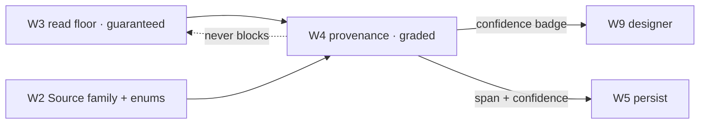

# Spec: provenance — confidence-graded source mapping & the census (W4)

> **Status:** 🟡 Draft v0.1 — best-effort, **honestly graded**, and gated by a pre-build reality census.
> **Branch:** `winui-devex` · **Owner:** (you) · **Workstream:** W4
> **Related:** `winapp-devtools-protocol.md` (the `Source` family + `SourceKind` / `Confidence` enums) ·
> `winapp-devtools-read.md` (the guaranteed floor this annotates) · `winapp-devtools-hot-reload.md`
> (persist consumes this mapping).

---

## 1. Summary

W4 answers "**which line of my source produced this live element?**" — select-to-source. It is the
capability that makes the designer feel magic. It is **also the least guaranteeable** part of the
system, so this spec is built around one principle: **grade every answer by confidence and never lie.**

Unlike the W3 read floor (guaranteed, config-independent), source mapping depends on **compiler-emitted
source metadata** that is:
- gated by build settings (line-info can be disabled),
- **stripped or absent in Release / trimmed builds**,
- missing for **templated**, **virtualized**, **style/binding-generated**, and certain
  **`x:Bind`-function** elements.

So W4 is **best-effort over a guaranteed floor** (the debate demoted select-to-source from headline to
graded feature). A cheap **pre-build census** measures how well it actually resolves on real apps
*before* the team funds anything that depends on it.

---

## 2. Goals & non-goals

| ID | Goal |
|----|------|
| **G1** | Map a live element handle → a source location, tagged with a **`SourceKind`** and a **`Confidence`**. |
| **G2** | **Never report false confidence** — an uncertain mapping is `low`/`none`, never `exact`. This is the prime directive. |
| **G3** | Classify *why* a mapping is imperfect (templated / generated / runtime-only / stripped) via `SourceKind` + `ReasonCode`. |
| **G4** | Ship a **census harness** that measures resolution rate across Debug/Release/packaged/trimmed on real apps — the cheapest falsifier (Gate 1). |
| **G5** | Provide mapping good enough for W5 **persist** to target the right span — or refuse persist when confidence is too low. |

**Non-goals**
- **Being the floor.** Tree + property read (W3) never depend on W4; if W4 returns `none`, inspect and
  hot-reload-in-place still work.
- **Guaranteeing Release mapping.** W4 measures and reports Release resolution honestly; it does not
  promise it.

---

## 3. The `Source` family (owned here)

From the schema (`winapp-devtools-protocol.md` §6):

| Command | Risk tier | Does |
|---|---|---|
| `resolve` | read | element handle → `{ uri, line, column, sourceKind, confidence }` (or `confidence: none`). |
| `census` | read | Run the resolution survey over a target app/config; return aggregate resolution rates by `SourceKind`. |

---

## 4. The honesty model

Two normative enums carry the honesty (W2):

**`Source.SourceKind`** — what *kind* of origin this element has:
```
source-backed · template-generated · style-generated · binding-generated ·
runtime-only · resource-origin · ambiguous · unreachable
```

**`Confidence`** — how sure we are of the span:
```
exact · high · low · none
```

Rules:
- A `source-backed` element with intact line-info → `exact`.
- A `template-generated` / `style-generated` element → mapped to the **template/style definition** at
  best, `low` confidence, and **never** presented as the user's page source.
- `runtime-only` (created in code with no line-info) or a Release build with stripped info →
  `confidence: none` + a `ReasonCode` (`release-no-line-info`, `source-info-missing`).
- **`ambiguous`** (multiple candidate spans) is reported as `low` with all candidates, never a coin-flip
  presented as truth.

The UI contract (for W9): render confidence as a **badge** — an `exact` link looks different from a
`low` guess — so the human/agent always knows how much to trust the jump.

---

## 5. The census (Gate 1 — the cheapest falsifier)

Before anything depends on select-to-source, run the census: attach to a set of **real apps** and
measure what fraction of visible elements resolve, by configuration.

| Config | What it probes |
|---|---|
| **Debug** | Upper bound (line-info intact). |
| **Release** | The honest field case — how much survives optimization. |
| **Packaged** | MSIX-installed reality. |
| **Trimmed / self-contained** | Worst case for metadata survival. |

**Gate-1 thresholds (kill-criteria):**

| Metric | Floor |
|---|---|
| Named/source-backed elements resolved in **Release** | **≥ 70%** |
| Templated/generated elements resolved (to template) in Release | **≥ 40%** |
| **False-confident rate** (reported `exact`/`high` that was wrong) | **0%** — any false-confident is an automatic KILL |

The false-confident rate is the one that can sink the feature: a select-to-source that *confidently
sends you to the wrong line* is worse than one that admits it doesn't know.

---

## 6. Backward compatibility & the standing gate

Additive `read`-tier capability; if unavailable, everything else is unaffected.

**Standing W4 gate:** the census thresholds in §5, re-run whenever the toolchain moves. **Zero
false-confident** is the release-blocking invariant.

**Testing:** unit-test the `SourceKind`/`Confidence` assignment against known fixtures (source-backed,
templated, runtime-only, Release-stripped); the census runs as a heavy gate against a small corpus of
real apps in all four configs.

---

## 7. Decisions & open questions

**Resolved:** provenance is graded best-effort over the guaranteed floor; false-confidence is
prohibited; the census is a pre-build funding gate; persist (W5) is confidence-gated.

**Open:**
- **Q-TEMPLATE-TARGET — template mapping target.** For a template-generated element, map to the template
  definition, the styling source, or both? Baseline: template definition, `low`.
- **Q-XBIND-FN — `x:Bind` function elements.** Confirm which `x:Bind` shapes carry usable info vs.
  `runtime-only`.
- **Q-CENSUS-CORPUS — the census app set.** Which real apps constitute a representative corpus (the
  number and mix that make the gate meaningful).

---

## 8. Rough implementation phases

1. **Resolve + grade.** `Source.resolve` with `SourceKind` + `Confidence` on Debug fixtures; wire the
   reason-codes.
2. **Census harness.** `Source.census` over Debug/Release/packaged/trimmed; aggregate reporting.
3. **Run Gate 1.** Execute the census on the real-app corpus; publish the rates; decide go/no-go on
   anything that *depends* on provenance.
4. **Persist integration.** Expose the confidence W5 needs; enforce the persist threshold.

## Appendix — where W4 sits


