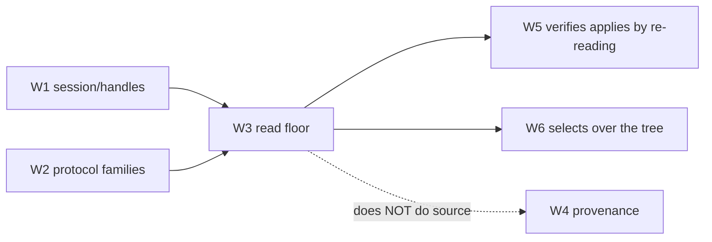

# Spec: the read floor — visual tree, properties & resources (W3)

> **Status:** 🟡 Draft v0.1 — the guaranteed read surface every other capability stands on.
> **Branch:** `winui-devex` · **Owner:** (you) · **Workstream:** W3
> **Related:** `winapp-devtools-protocol.md` (the `VisualTree` / `Property` / `Resource` families) ·
> `winapp-run-inspect.md` (the session + handle model this reads through) ·
> `winapp-devtools-provenance.md` (W4 — source mapping, deliberately **not** here).

---

## 1. Summary

W3 is the **floor**: enumerate the live visual tree, read any dependency property **with its
value-source precedence**, and resolve resources — for a running WinUI app, over the protocol. It is
the capability everything else (hot-reload verification, selection, the designer) reads through.

The floor has one defining property: **it is guaranteed and configuration-independent.** Unlike
select-to-source (W4), which degrades in Release/trimmed builds, tree + property + resource read works
the same in Debug and Release because it queries the **live object graph**, not compiler-emitted source
metadata. The proof-of-concept demonstrated this end-to-end (enumerate, read values with precedence,
resolve resources) on a running app.

---

## 2. Goals & non-goals

| ID | Goal |
|----|------|
| **G1** | Enumerate / subscribe / search the live visual tree and return stable, session-scoped **handles** (W1). |
| **G2** | Read any dependency property as its **effective value + value-source** (`local` … `default`) — not just the value. |
| **G3** | Resolve `{ThemeResource}` / `{StaticResource}` to concrete values against the live element's lookup scope. |
| **G4** | Be **configuration-independent**: identical results in Debug and Release (the standing W3 gate). |
| **G5** | Be **honest about incompleteness**: unreachable subtrees (popups, virtualized, templated) are reported with a reason-code, never silently dropped or faked. |

**Non-goals**
- **Source mapping / provenance** — element→source, confidence grading, and the Release census are W4.
  W3 returns the *live* tree; it does not claim where a node came from.
- **Mutation** — set-property / structural edits are W5. W3 is read-only (`read` risk tier).
- **Selection overlay** — highlight/pick is W6; W3 provides the tree it selects over.

---

## 3. Capability families (owned here)

W3 implements three of the protocol's read-tier families (`winapp-devtools-protocol.md` §6):

| Family | Commands (from the schema) | Notes |
|---|---|---|
| **VisualTree** | `getRoots`, `getChildren`, `getElement`, `search`, `subscribe` (+ `treeChanged` event) | Handle-returning; lazy by default (children on demand). |
| **Property** | `get`, `getAll`, `getMetadata`, `describe` | Every value carries a **value-source** (§4). |
| **Resource** | `resolve`, `enumerate` | Scope-aware lookup against the live element. |

All are `read` risk tier — **session-grant** (no explicit per-call consent), per W8.

---

## 4. Value-source precedence (the headline)

A read doesn't just return "the Background is `#FF0000`." It returns **where that value came from** in
the dependency-property precedence chain. The normative `Property.ValueSource` enum (W2):

```
local  ›  animation  ›  template  ›  style  ›  resource  ›  inherited  ›  default
```

So a client can distinguish "this brush was set locally in XAML" from "this brush came from the
active theme's `ThemeResource`" from "this is the property's default." This is the difference between
an inspector that shows a value and one a developer can *reason about* — and it is exactly what a
hot-reload client needs to know before it overwrites a value.

`Property.get` returns, per property: effective value, `valueSource`, the declaring type, and whether
it is animatable / read-only (from `getMetadata`).

---

## 5. Honest incompleteness

The live tree has regions that are legitimately hard to reach. W3's rule: **return what is reachable
and attach a `Diagnostics.ReasonCode`** for what is not — never fabricate and never silently omit.

| Situation | Behavior | Reason-code (W2) |
|---|---|---|
| Open popup / flyout in a secondary tree | Enumerate it if the diagnostics surface exposes it; otherwise mark the anchor incomplete. | `unreachable-popup` |
| Virtualized items not realized | Return realized containers; flag that more exist off-realization. | *(field on the node, not an error)* |
| Templated / generated children | Return them, marked as template-generated so W4 doesn't over-claim source. | `template-generated` |

Incompleteness is **data, not failure**: a partial enumeration succeeds and is labeled, so a client
renders "3 of N realized" rather than believing it saw everything.

---

## 6. Threading & handles (delegated to W1)

W3 does **not** re-implement threading. Reads enumerate on the worker/MTA thread via the Global
Interface Table exactly as W1's daemon establishes; W3 is the set of read operations the daemon
exposes. Handles are session-scoped with generation stamps: a `getChildren` on a stale handle returns
`StaleHandle (-32001)`, prompting the client to re-`getElement`.

---

## 7. Backward compatibility & the standing gate

W3 adds only read capabilities behind an attached session — no CLI default behavior changes.

**Standing W3 gate — configuration independence:**

| Gate | Threshold |
|---|---|
| **Debug = Release read parity** | Enumerate + property-read + resource-resolve return the **same** tree shape and values in a Debug and a Release build of the same app. |
| **No source dependency** | The floor must not regress when source info is absent (that regression belongs only to W4). |
| **Incompleteness labeled** | Every unreachable region carries a reason-code; a golden trace asserts it (mirrors protocol `golden:02-read-floor`). |

**Testing:** unit-test the tree/property/resource operations against a fake diagnostics surface; the
Debug=Release parity gate runs the read golden trace against a live fixture in both configurations.

---

## 8. Decisions & open questions

**Resolved:** read floor is `read` risk tier, session-grant; value-source is mandatory on every
property read; incompleteness is labeled data.

**Open:**
- **Q-SEARCH — search semantics.** By name / type / property predicate — which are in the v1 `search`?
  Baseline: name + type; predicate search is a fast-follow.
- **Q-SUBSCRIBE — event granularity.** Whole-subtree vs per-node `treeChanged` deltas; baseline is
  coarse subtree invalidation, refine if clients need finer deltas.
- **Q-VIRTUAL — virtualization visibility.** How much to expose about un-realized items without forcing
  realization (which would change app behavior). Baseline: never force realization.

---

## 9. Rough implementation phases

1. **Enumerate + handles.** `getRoots`/`getChildren`/`getElement` over the W1 session; generation
   stamps; the read golden trace.
2. **Property + value-source.** `get`/`getAll`/`getMetadata` with the precedence enum; animatable /
   read-only metadata.
3. **Resource resolve.** Scope-aware `{ThemeResource}`/`{StaticResource}` resolution.
4. **Incompleteness + subscribe.** Reason-codes for popups/virtualized/templated; `subscribe` +
   `treeChanged`.
5. **Config-parity gate.** Wire the Debug=Release read golden trace into the heavy gates.

## Appendix — where W3 sits


