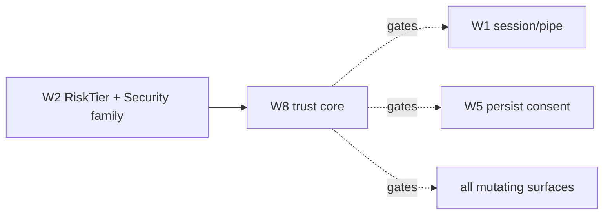

# Spec: security, durability & EDR (W8)

> **Status:** 🟡 Draft v0.1 — the trust core. A gate on every mutating surface, not a bolt-on.
> **Branch:** `winui-devex` · **Owner:** (you) · **Workstream:** W8
> **Related:** `winapp-devtools-protocol.md` (the `Security` family + `RiskTier` + `Unauthorized` /
> `RefusedUnsafe` errors) · `winapp-run-inspect.md` (the pipe + session this secures) ·
> `winapp-devtools-hot-reload.md` (persist is the highest-consent operation).

---

## 1. Summary

W8 is the trust model for a tool that **attaches to a running process, reads its internals, and mutates
its live state** — and, on persist, **writes the user's source files**. That is powerful and therefore
must be governed centrally: who can connect, what each capability is allowed to do without asking, when
explicit consent is required, and what is audited.

It also owns **durability**: a runtime-diagnostics attach *resembles code injection*, so endpoint
protection (EDR/anti-malware) may flag or block it; the WinUI diagnostics interfaces track the SDK, so
they can move under us. Both are treated as **first-class gates**, because the debate's harshest finding
was that a design-time tool which dies on a corporate EDR image or breaks on the next SDK release is not
shippable to the enterprise no matter how good the inspect experience is.

**Development-time context helps.** This tooling targets developer machines in Developer Mode, on Debug
builds, per-user — a much smaller trust surface than a production agent. W8 leans on that context but
does not assume it away.

---

## 2. Goals & non-goals

| ID | Goal |
|----|------|
| **G1** | Enforce the protocol's **risk tiers**: `read` / `mutate-ephemeral` / `structural` are session-grant; `persist` / `privileged` require **explicit consent**. |
| **G2** | Secure the transport: **per-user pipe** ACLs + a **session token**, so only the launching user's clients can connect. |
| **G3** | **Consent + capability grants**: a client negotiates capabilities; elevated tiers prompt/require an explicit grant that is recorded. |
| **G4** | **Audit**: every mutating and persisting operation is logged (who/what/when/outcome) for after-the-fact review. |
| **G5** | **EDR survival** is a mandatory gate: the attach path is code-signed, documented, and validated on an EDR-enabled image. |
| **G6** | **SDK-servicing treadmill** gate: a CI check re-validates the diagnostics contract against each new Windows App SDK release. |

**Non-goals**
- **Re-inventing OS security.** W8 uses Windows pipe ACLs, code-signing, and Developer Mode; it does not
  build a bespoke auth system.
- **Sandboxing the target app.** W8 governs the *tool's* access, not the app's own behavior.

---

## 3. The `Security` family (owned here)

From the schema (`winapp-devtools-protocol.md` §6); `experimental` in v0:

| Command | Risk tier | Does |
|---|---|---|
| `grant` | privileged | Grant a capability/tier to the session (explicit consent for `persist`/`privileged`). |
| `revoke` | privileged | Revoke a previously granted capability. |
| `audit` | read | Return the audit log for the session. |
| *event* `consentRequired` | — | Fires when a client requests an operation above its current grant. |

---

## 4. The risk-tier gate

The protocol's `RiskTier` enum (W2) is the spine of W8. Every command declares a tier; W8 enforces it:

| Tier | Examples | Default policy |
|---|---|---|
| **read** (0) | tree/property/resource read, source resolve | **session-grant** — allowed on a connected session. |
| **mutate-ephemeral** (1) | set property, highlight, annotate | **session-grant** — reversible, no source impact. |
| **structural** (2) | preview/commit runtime structure edits | **session-grant** — reversible in-session. |
| **persist** (3) | write an edit back to **source files** | **explicit consent** — per-grant, audited. |
| **privileged** (4) | grant/revoke, capability changes | **explicit consent**. |

A request above the current grant returns `Unauthorized (-32004)` and raises `consentRequired`. An
unsafe operation the engine refuses returns `RefusedUnsafe (-32005)`. This keeps the honest-refusal
behavior visible to clients rather than silent.

---

## 5. Transport & identity

- **Per-user pipe.** The daemon's endpoint is created for the current user only (`CurrentUserOnly`),
  so another user on the machine cannot connect.
- **Session token.** The launching `winapp run --inspect` prints (or `--json`-emits) a token; clients
  must present it to open a session. This stops an unrelated local process from silently attaching.
- **Least privilege.** A client gets only the capabilities it negotiates; nothing above `structural`
  without an explicit grant.

---

## 6. Durability — the two treadmills

| Threat | Gate | Kill-criterion |
|---|---|---|
| **EDR / anti-malware** flags the diagnostics attach as injection and blocks it. | Run the full attach + mutate flow on a representative **EDR-enabled image**; the attach path is **code-signed** and uses a **documented, platform-alignable** connect sequence. | If the tool cannot attach on a standard corporate EDR image, the enterprise story is blocked until it can. |
| **SDK-servicing treadmill** — the diagnostics interfaces move in a new Windows App SDK. | A CI gate re-runs the read/apply smoke against each **new WinAppSDK release** and flags contract drift early. | Silent breakage on an SDK bump is a release-blocker; the gate must catch it before users do. |
| **Self-contained / ARM64 / soak** durability. | Matrix the attach + read + apply across self-contained, framework-dependent, x64 and ARM64, plus a long-running soak (no handle/leak growth). | Leak growth or an arch-specific failure blocks the corresponding claim. |

---

## 7. Backward compatibility & the standing gate

W8 changes no default `winapp` behavior; it governs the new attached-session surface.

**Standing W8 gates:** the risk-tier enforcement (unit + conformance), the **EDR-survival** matrix, the
**SDK-treadmill** CI check, and the durability matrix (§6). These are **hard gates** — the debate's
position is that inspect/hot-reload quality does not offset an untrusted or fragile attach.

**Testing:** unit-test tier enforcement, token checks, and audit logging; the EDR/SDK/durability matrices
run as heavy gates on real images.

---

## 8. Decisions & open questions

**Resolved:** risk tiers are the enforcement spine; `persist`/`privileged` need explicit consent;
per-user pipe + session token; EDR-survival and SDK-treadmill are mandatory gates.

**Open:**
- **Q-CONSENT-UX — how consent is obtained.** A CLI prompt, an OS dialog, or a config-file grant for
  headless/CI? Baseline: interactive prompt + a `--grant` opt-in for automation.
- **Q-EDR-PATH — the alignable attach path.** Which connect sequence is both functional and least likely
  to trip EDR; pursue platform alignment so official tooling is trusted.
- **Q-AUDIT-SINK — where audit logs live** and their retention.
- **Q-MULTI-CLIENT — trust between concurrent sessions** (ties to W1's Q-CONCURRENCY): does one client's
  grant affect another? Baseline: grants are per-session.

---

## 9. Rough implementation phases

1. **Tier enforcement.** Wire `RiskTier` checks + `Unauthorized`/`RefusedUnsafe` into the daemon;
   conformance for the honest-refusal paths.
2. **Transport identity.** Per-user pipe ACL + session token issuance/validation.
3. **Consent + audit.** `grant`/`revoke`/`consentRequired` + the audit log; the persist-consent path.
4. **EDR gate.** Code-sign the attach path; validate on an EDR image; document the connect sequence.
5. **SDK-treadmill + durability.** CI check against new SDK releases; the self-contained/ARM64/soak
   matrix.

## Appendix — where W8 sits

