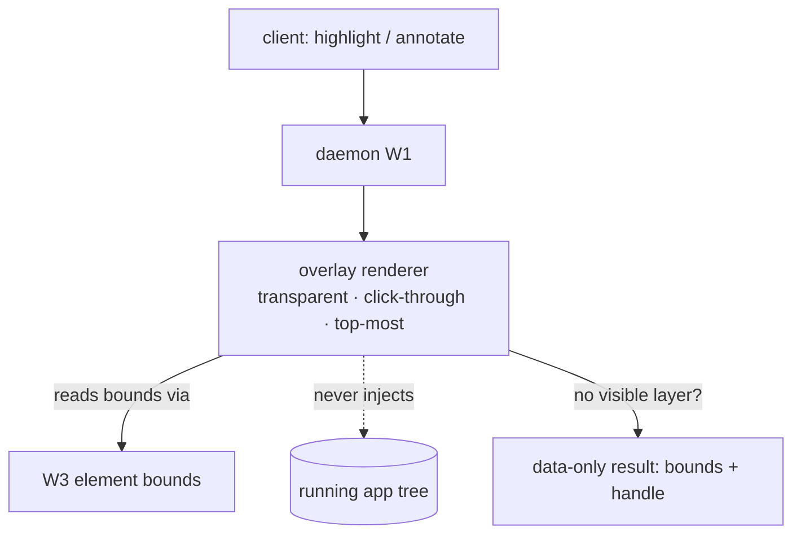
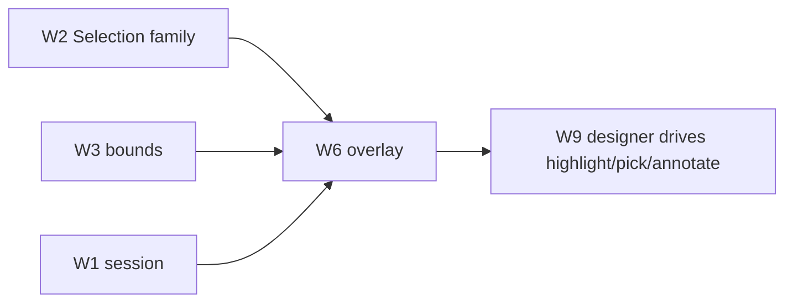

# Spec: selection & annotation — the out-of-process overlay (W6)

> **Status:** 🟡 Draft v0.1 — the visual layer clients drive to point at, and mark up, live UI.
> **Branch:** `winui-devex` · **Owner:** (you) · **Workstream:** W6
> **Related:** `winapp-devtools-protocol.md` (the `Selection` family) · `winapp-devtools-read.md`
> (the tree it selects over) · `winapp-devtools-overview.md` §6 (annotations live **here**).

---

## 1. Summary

W6 is the **visual pointing layer**: highlight an element, let a user pick an element by clicking on
the live app, and draw **annotations** (labeled callouts/markers) on the running UI — all driven
through the protocol so a CLI, an agent, VS Code, or the in-app window can do it uniformly.

The load-bearing design choice is **out-of-process, non-invasive rendering**: the overlay is a separate
transparent, click-through layer, **not** injected into the app's own visual tree. It must never force
the app to lay out, never steal input it shouldn't, and never lag the app's own rendering. If the
overlay can't render for any reason, selection degrades to a **data-only** result (bounds + handle) so
clients still work.

**Annotations are not bolted on.** They are the same overlay's second job: the machinery that draws a
highlight rectangle around a picked element also draws labeled annotations and clears them. That's why
annotations belong in the Selection family, driven like every other capability (per your direction).

---

## 2. Goals & non-goals

| ID | Goal |
|----|------|
| **G1** | **Highlight** a given element handle (draw its bounds on screen) on request. |
| **G2** | **Pick** — enter a mode where the user clicks the live app and the element under the cursor is resolved to a handle (like a browser's element picker). |
| **G3** | **Annotate** — draw labeled markers/callouts anchored to elements or points, and **clear** them, through the protocol. |
| **G4** | Render **out-of-process** and **non-invasively**: never force layout, never lag the app > 1 frame, never inject into the app tree. |
| **G5** | Degrade to a **data-only** result (bounds + handle, no visible overlay) when rendering isn't possible — never fail the selection. |
| **G6** | Be correct across **multi-monitor**, **high-DPI**, and window move/resize. |

**Non-goals**
- **The property/tree data** — that's W3; W6 points at what W3 enumerates.
- **Editing** — clicking to select doesn't mutate; edits go through W5.
- **The visual client chrome** — the designer's tree view / property grid is W9; W6 is just the
  on-app overlay it commands.

---

## 3. The `Selection` family (owned here)

From the schema (`winapp-devtools-protocol.md` §6); `experimental` in v0:

| Command | Risk tier | Does |
|---|---|---|
| `highlight` | mutate-ephemeral | Draw/refresh the overlay for one or more element handles. |
| `pick` | mutate-ephemeral | Enter interactive pick mode; resolve the clicked element → handle; emit `picked`. |
| `annotate` | mutate-ephemeral | Add labeled annotation(s) anchored to a handle or a point. |
| `clear` | mutate-ephemeral | Remove highlights / annotations (by id or all). |
| *event* `picked` | — | Fires with the resolved handle when the user picks. |

All are `mutate-ephemeral` (session-grant, reversible, no source impact) — they change what's *drawn on
top*, never the app.

---

## 4. Out-of-process overlay design

- **A separate transparent, top-most, click-through window** tracks the target app window (position,
  size, z-order, DPI). Highlights and annotations are drawn there.
- **Bounds come from W3** (element rect in screen coordinates), transformed for the target window's DPI
  and monitor. No app-side layout is triggered.
- **Pick mode** temporarily captures the pointer over the app's client area, hit-tests against the live
  tree (via the diagnostics surface), and resolves to a handle — then releases capture.
- **Data-only fallback (G5):** if a transparent overlay can't be created (e.g. a restricted session or
  a rendering path that doesn't allow it), `highlight`/`pick` still return the element bounds + handle
  so a client can draw its own indicator or just use the data.

---

## 5. The correctness hazards (why this is its own workstream)

| Hazard | Rule |
|---|---|
| **Forcing layout** | Reading bounds must use cached/latest layout, never trigger a measure/arrange pass on the app. |
| **Input theft** | The overlay is click-through except during explicit `pick`; it must restore input exactly on `clear`/pick-end. |
| **Lag** | Overlay updates track the app within **1 frame**; a slower overlay that visibly trails the app fails the gate. |
| **DPI / multi-monitor** | Bounds transform per the target window's current DPI + monitor; verified on mixed-DPI setups. |
| **Window lifecycle** | Overlay follows move/resize/minimize/z-order and tears down cleanly on app exit. |

---

## 6. Backward compatibility & the standing gate

Additive behind an attached session; nothing renders unless a client asks.

**Standing W6 gate:**

| Gate | Threshold |
|---|---|
| **Non-invasive** | Overlay never forces an app layout pass and never lags the app by more than 1 frame. |
| **Degrade-safe** | With rendering disabled, `highlight`/`pick` still return bounds + handle (data-only), and `annotate` reports `applied-inert` rather than failing. |
| **DPI/multi-monitor** | Highlight aligns to the element on mixed-DPI, multi-monitor, and after window move/resize. |

**Testing:** unit-test the coordinate/DPI transforms and the annotation model; the non-invasive + DPI
gates run against a live fixture (heavy gate).

---

## 7. Decisions & open questions

**Resolved:** overlay is out-of-process, transparent, click-through; annotations are a Selection-family
capability; data-only degrade is mandatory.

**Open:**
- **Q-ANCHOR — annotation anchoring.** Anchor to a handle (moves with the element) vs a fixed screen
  point. Baseline: handle-anchored with a point fallback.
- **Q-PICK-SCOPE — pick hit-testing.** Topmost element vs a depth-cycle (like browser dev tools'
  hover-to-parent). Baseline: topmost + a "select parent" follow-up.
- **Q-OVERLAY-TECH — overlay implementation.** The exact transparent-window technology and whether a
  single overlay covers all monitors or one-per-window. Prototype-driven.

---

## 8. Rough implementation phases

1. **Bounds + highlight.** Screen-space bounds from W3; a single-element highlight overlay with DPI
   transform.
2. **Pick mode.** Pointer capture + live hit-test → handle; `picked` event; input restoration.
3. **Annotations.** Anchored labels/callouts; `annotate`/`clear`; the annotation model + ids.
4. **Robustness.** Multi-monitor, mixed-DPI, window lifecycle tracking; the data-only degrade path.
5. **Gate.** Non-invasive + DPI heavy-gate against the fixture.

## Appendix — where W6 sits

