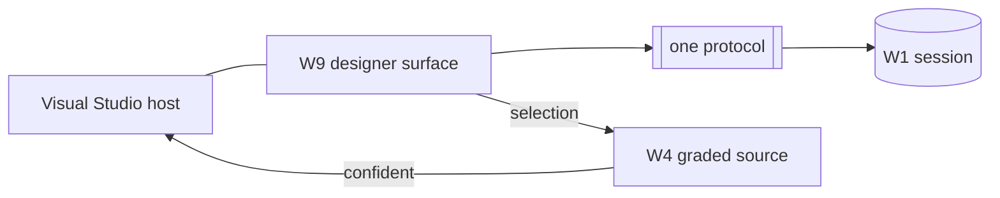

# Spec: the Visual Studio host (W12)

> **Status:** 🟡 Draft v0.2 — **first-class v1 host.** The designer's headline home.
> **Branch:** `winui-devex` · **Owner:** (you) · **Workstream:** W12
> **Related:** `winapp-devtools-designer.md` (W9, the surface it frames) ·
> `winapp-devtools-vscode.md` (W10, its peer IDE host) · `winapp-run-inspect.md` (W1, the session) ·
> `winapp-devtools-provenance.md` (W4, select-to-source as an editor jump) ·
> `winapp-devtools-overview.md` (§8 milestones).

---

## 1. Summary

W12 hosts the design-time surface inside **Visual Studio** as a **first-class v1 IDE host, beside VS
Code** (W10). Its headline value is the **designer** — a live, running-app visual authoring surface.
WinUI 3 has **no visual designer in Visual Studio today**, and a designer is one of the community's
**top-priority** long-standing asks; W12 is where we deliver it.

W12 is a **thin client of the protocol** — it frames the shared W9 surface and speaks the one protocol.
It holds **no** engine logic of its own, so hosting the designer in VS costs no engine fork and reuses
everything the other hosts use. Crucially, the engine (W1–W8) and the surface (W9) **do not assume VS** —
VS is purely a downstream frame — which keeps the surface reusable across every host and keeps VS a
clean, additive host rather than a special case.

**v1 scope:** the **read designer + live property editing** (tiers 0–1), same as every host in v1. The
fuller **authoring** the designer is famous for — structural edits + **save-to-XAML** (tiers 2–3) — is
the **immediate next priority** in the main plan (tracked in W9), gated on the W4 census + W8 consent
proving out, **not deferred**.

---

## 2. Goals & non-goals

| ID | Goal |
|----|------|
| **G1** | Host the W9 surface (tree + property grid + selection) in Visual Studio as a **first-class v1** experience, peer to VS Code. |
| **G2** | Deliver the **designer** WinUI developers ask for in VS: a live view of the running app they can select in and edit — starting with property editing in v1. |
| **G3** | **Select-to-source** in the VS editor, honoring W4 confidence (no jump on `low`/`none`). |
| **G4** | Stay a **thin host**: reuse W1/W9 + the protocol **unchanged**; no VS-specific engine logic. |
| **G5** | Keep the engine + surface **VS-agnostic** (a no-coupling discipline) so VS remains an additive host. |

**Non-goals**
- **No engine/diagnostics logic** — W12 is a host over the daemon (W1).
- **No v1 structural/persist** — inherits W9's v1 scope (read + property edit); full authoring is the
  immediate next milestone, owned by W9, not this spec's v1 slice.
- **Not a fork of the surface** — W12 frames W9, it doesn't reimplement it.
- **No upstream dependency on VS** — no other workstream may depend on W12.

---

## 3. Why Visual Studio — the designer

The design-time value proposition lands hardest in VS for a concrete reason: **WinUI 3 shipped without
the visual designer that earlier XAML stacks had, and developers have asked for one as a top priority.**
The existing in-VS live-editing story is limited (XAML-only, debugger-tied). W12 answers that directly —
a **live, running-app designer** — and, because it's built on the shared surface + protocol, it does so
**without locking the capability to VS**: the same designer also runs in VS Code (W10) and in-app (W11).

So VS is a **headline host, not a fallback**: it's where the community most expects a designer, and
where delivering one has the most pull — while the IDE-agnostic architecture means we meet developers
wherever they are.

---

## 4. Shape

Identical hosting model to VS Code (W10), different frame:

- **Thin host:** frame the surface, wire VS editor navigation for select-to-source (honoring W4
  confidence), speak the protocol.
- Inherits W9's **capability gradient** and the current milestone scope: **inspect + tune** first, then
  the **compose + persist** authoring notches as they unlock in the main plan.

---

## 5. Relationship to VS Code (W10)

W12 and W10 are **peers** — two first-class IDE hosts over the same surface and protocol. They differ
only in the **frame** (a VS host vs a VS Code extension) and each IDE's editor integration. Building both
is cheap precisely because neither contains engine logic: the shared W9 surface + generated protocol
client (W7) are reused, so the incremental cost of a second IDE host is the frame + editor glue, not a
second engine.

---

## 6. Transport

W12 connects to the session the same way any client does — over the daemon pipe (W1), reusing the
generated client contract (W7). It invents no transport. The VS host is a **thin frame**: host the
surface, wire the editor, speak the protocol.

---

## 7. Backward compatibility & the standing gate

W12 is a new host; it changes no `winapp` behavior, no engine, and no other host.

**Standing W12 gate:** an **in-IDE round-trip** — from Visual Studio, attach to the fixture session,
render the designer, select an element, confirm the editor **jumps to the correct source when
confidence is high and does not jump on `low`/`none`**, edit a property value, and see the honest
outcome (applied vs applied-inert). Plus a **no-coupling check**: CI/asserts confirm no W1–W9 component
references or assumes VS, so the surface stays reusable and VS stays additive.

**Testing:** VS host integration tests against a live fixture session + recorded-session component tests
for the surface.

---

## 8. Decisions & open questions

**Resolved:** VS is a first-class v1 host beside VS Code; its headline value is the designer (a top
community ask); thin host framing W9; v1 = read + property edit, with full authoring the immediate next
priority (owned by W9); the engine/surface stay VS-agnostic.

**Open:**
- **Q-VS-VEHICLE — delivery vehicle.** VSIX extension vs tool-window packaging, and how the designer
  surface is hosted inside VS (embedded web view vs native) — ties to W9 Q-RENDER-TECH.
- **Q-VS-ALIGN — alignment with any first-party VS design-time surface.** Treated as an **enabler/
  partnership** opportunity, **not a gate** on shipping W12.
- **Q-VS-JUMP — confidence bar for auto-jump** (mirror W10: auto-jump on `exact`/`high`, show-candidate
  on `low`, nothing on `none`).

## 9. Rough implementation phases

1. **Attach + render.** VS command to launch/attach a session; embed the W9 **read** designer.
2. **Select-to-source.** Wire selection → W4 → VS editor navigation with the confidence gate.
3. **Tune.** Tier-1 property-value editing from the designer with honest outcomes.
4. **(Immediate next, tracked in W9) Authoring.** compose + persist notches as the census/consent gates
   clear.

## Appendix — host, not engine

W12 = a Visual Studio frame + editor glue over W9 + the protocol. The engine (W1–W8) is unaware it's
being hosted in VS — which is exactly what lets VS be a first-class host at the cost of a frame, not a
fork.
