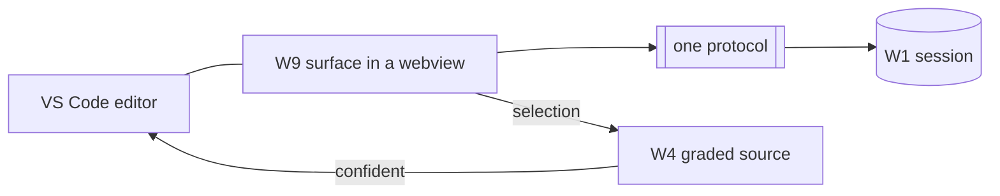

# Spec: the VS Code host (W10)

> **Status:** 🟡 Draft v0.1 — a first-class IDE host (beside Visual Studio). Where the visual surface meets the editor.
> **Branch:** `winui-devex` · **Owner:** (you) · **Workstream:** W10
> **Related:** `winapp-devtools-designer.md` (W9, the surface it frames) ·
> `winapp-devtools-cli.md` (W7, the client transport it can reuse) · `winapp-run-inspect.md` (W1,
> the session) · `winapp-devtools-provenance.md` (W4, select-to-source lands here as an editor jump).

---

## 1. Summary

W10 hosts the design-time experience inside **VS Code — a first-class IDE host (beside Visual Studio)**
for this work. It embeds
the W9 visual surface (tree + property grid + selection) in the editor, and adds the thing only an IDE
host can: **editor integration** — select an element in the running app and **jump to its XAML/C#
source**, edit in the surface and see it reflected, all beside the code.

It is a **client of the protocol**, not a second engine. It connects to the session started by
`winapp run --inspect` (W1), reuses the CLI/daemon transport (W7/W1), and frames the W9 surface. Because
the engine and the visual surface are host-agnostic, VS Code becomes "just" the first and most important
frame — which is exactly the ecosystem hedge the debate demanded (meet developers in the IDE they use,
without re-implementing anything).

---

## 2. Goals & non-goals

| ID | Goal |
|----|------|
| **G1** | Embed the W9 surface in a VS Code view (tree + property grid + selection) against a live session. |
| **G2** | **Select-to-source:** picking an element navigates the editor to the resolved source — honoring W4 confidence (no jump on `low`/`none`). |
| **G3** | Start/attach a session from the IDE: surface `winapp run --inspect`/`--watch` as an IDE action. |
| **G4** | v1 editing: tier-1 property-value edits from the surface, with honest outcomes. |
| **G5** | Reuse the one protocol + the W9 surface — **no** VS Code-specific engine logic. |

**Non-goals**
- **No engine logic** — W10 is a host over the daemon.
- **No v1 structural/persist editing** — inherits W9's v1 scope (read + property edit); later milestone.
- **Not a fork of the surface** — W10 frames W9, it doesn't reimplement it.

---

## 3. What the IDE host adds

The daemon + W9 give tree/property/selection/edit. VS Code adds the **editor-side** half:

| Capability | How |
|---|---|
| **Select-to-source jump** | On selection, the host takes W4's resolved `Source` (graded) and, when confidence is sufficient, opens the file at the line. `low`/`none` → show the candidate, don't auto-jump. |
| **Session control** | IDE commands to launch `--inspect`/`--watch` and attach the surface. |
| **Edit affinity** | Property edits from the surface and file edits from the editor both flow through the one session, so the running app and the code stay coherent. |
| **Diagnostics surfacing** | Protocol `ReasonCode`s (parse-error, binding-failure) shown as editor diagnostics. |

---

## 4. Transport

W10 connects to the session the same way any client does — over the daemon pipe (W1), reusing the
generated client contract (W7). It does not invent a transport. The extension is a **thin host**: frame
the surface, wire the editor, speak the protocol.

> This also keeps the door open the debate wanted: because clients are generated from one schema and the
> host is thin, the same investment can be reused by other hosts without protocol change.

---

## 5. Backward compatibility & the standing gate

W10 is a new, opt-in extension; it changes no `winapp` behavior and no other host.

**Standing W10 gate:** an **in-IDE round-trip** — from VS Code, launch `--inspect` on the fixture,
render the surface, select an element, confirm the editor **jumps to the correct source when confidence
is high and does not jump on `low`/`none`**, edit a property value, and see the honest outcome. The
select-to-source honesty check is the load-bearing assertion (it's the feature W4 grades).

**Testing:** extension integration tests against a live fixture session + recorded-session component
tests for the surface.

---

## 6. Decisions & open questions

**Resolved:** VS Code is a first-class IDE host (beside Visual Studio); it's a thin protocol client framing W9; select-to-source
is a host feature honoring W4 confidence; v1 scope inherits W9 (read + property edit).

**Open:**
- **Q-EXT-BASE — build on the existing winapp VS Code extension** vs a dedicated design-time extension.
  Baseline: extend the existing winapp extension so `run`/`--inspect`/design-time live together.
- **Q-WEBVIEW — surface hosting** (webview vs native tree views) and how much of W9 is portable here vs
  re-skinned. Ties to W9 Q-RENDER-TECH.
- **Q-JUMP-THRESHOLD — the confidence bar for auto-jump** (`exact` only, or `exact`+`high`). Baseline:
  auto-jump on `exact`/`high`; show-candidate on `low`; nothing on `none`.

## 7. Rough implementation phases

1. **Attach + render.** IDE command to launch/attach a session; embed the W9 read surface.
2. **Select-to-source.** Wire selection → W4 → editor navigation with the confidence gate.
3. **Tune.** Tier-1 property editing from the surface with honest outcomes.
4. **Diagnostics.** Surface protocol `ReasonCode`s as editor diagnostics.

## Appendix — host, not engine

W10 = VS Code frame + editor glue over W9 + the protocol. The engine (W1–W8) is unaware it's being
hosted in an IDE.
