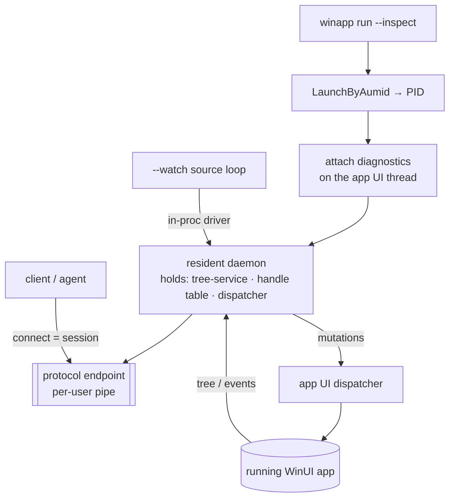
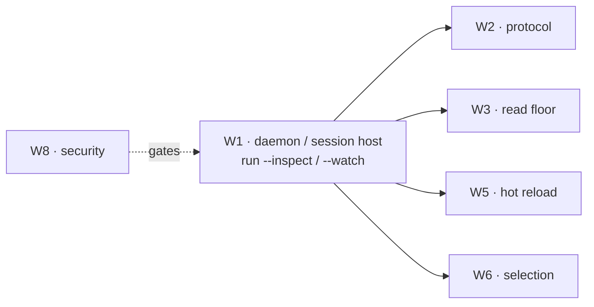

# Spec: `winapp run --inspect` / `--watch` — the design-time host & session broker

> **Status:** 🟡 Draft v0.1 — the entry point for the whole design-time surface.
> **Branch:** `winui-devex` · **Owner:** (you) · **Author of draft:** Copilot · **Workstream:** W1
> **Related:** `winapp-devtools-overview.md` (the map) · `winapp-devtools-protocol.md` (the wire
> contract this hosts) · `winapp-run-csproj.md` (the `winapp run` this extends).
>
> **What this spec owns.** The two new `winapp run` flags — `--inspect` and `--watch` — and the
> **resident daemon** behind them: how it attaches the diagnostics surface to the launched app, holds a
> live session across calls, owns the threading discipline once for every client, and tears down
> cleanly. It is the layer every capability (read, hot-reload, selection) plugs into. It does **not**
> define the wire messages (that's W2) or any capability's semantics (W3–W6).

---

## 1. Summary

`winapp run` today launches a WinUI app and waits for it to exit. This spec adds a **design-time host**
to that same command:

- **`winapp run --inspect`** — after launch, attach the WinUI **Visual Diagnostics** surface to the
  running app and host a **resident daemon** that serves the protocol (`winapp-devtools-protocol.md`)
  over a per-user pipe. Any client — the CLI itself, an editor, an in-app panel, an AI agent — connects
  and drives the live visual tree.
- **`winapp run --watch`** — host the same daemon **plus** a source watcher that rebuilds/re-applies
  edits to the running app (the hot-reload loop, W5). Source edits and client edits go through one
  apply path.
- **`winapp run --inspect --watch`** — both at once: a file-driven hot-reload loop **and** a live
  client/agent surface over the same running instance.

The load-bearing idea is a **persistent broker**. A stateless, per-call CLI process cannot hold a live
WinUI object's COM identity, its handle table, or the app's UI dispatcher between calls — so it can
never say "the button you read last call is the button I'm setting this call." The daemon holds that
state for the lifetime of the session. A working proof-of-concept confirmed this is required and
achievable within budget (live object identity persisted across calls at low latency).

---

## 2. Goals & non-goals

| ID | Goal |
|----|------|
| **G1** | Add `--inspect` and `--watch` to `winapp run` as composable flags on the existing launch path — no new top-level command, no change to default behavior. |
| **G2** | Attach the diagnostics surface to the launched app and host a **resident daemon** that keeps the diagnostics interface, a handle table with generation stamps, and the UI dispatcher alive **across calls**. |
| **G3** | Own the **threading discipline** once, centrally, so no client can deadlock or cross-thread the app (see §7). |
| **G4** | Expose the daemon over the W2 transport: one pipe connection = one session, capabilities negotiated per session, structured teardown. |
| **G5** | Reuse the existing launch, process-wait, terminate, and `--json` machinery rather than reimplementing app lifecycle. |
| **G6** | Meet a measured floor: **< 50 ms** per round-trip call and **stable live-object identity** across a session — the standing W1 gate. |

**Non-goals**
- **The wire messages / schema** — owned by W2 (`winapp-devtools-protocol.md`). W1 hosts it.
- **Capability semantics** — tree/property read (W3), hot-reload/apply (W5), selection/annotation (W6)
  are their own specs. W1 provides the session they run in.
- **Clients** — the CLI facade, editor, and in-app surfaces are W7/W9. W1 serves them.
- **The security model** — pipe ACLs, consent, capability grants are W8. W1 exposes the seams; W8
  fills them.
- **Attaching to arbitrary already-running apps** the CLI didn't launch — see Q-ATTACH (§10).

---

## 3. Current behavior (what `winapp run` does today)

`winapp run <folder>` builds the app to MSIX, registers it, launches it, and holds the foreground until
it exits. The relevant existing machinery this spec builds on:

| Existing piece | What it does today | How W1 uses it |
|---|---|---|
| `IAppLauncherService.LaunchByAumid(aumid)` | Activates the packaged app, returns its **PID**. | The daemon attaches to that PID. |
| `--detach` | Launch and return immediately, print PID (JSON-aware). | Precedent for a background/daemon lifetime option. |
| `--debug-output` → `RunDebugLoopAsync(pid, …)` | Holds the process and runs a **resident event loop** against it. | Direct precedent: the inspect daemon is a resident loop in the same slot. |
| default `Process.GetProcessById(pid).WaitForExitAsync(ct)` | Waits for exit; **Ctrl+C** → `TerminatePackageProcesses`. | The daemon runs *instead of* a bare wait, and reuses the same terminate-on-cancel path. |
| `--unregister-on-exit` | Cleans up the registered package on exit. | Reused unchanged for `--inspect`/`--watch` sessions. |
| `--json` → `RunCommandResult { AUMID, ProcessId, Error }` | Structured launch result. | Extended with a `session` block (endpoint + token) — see §6. |

**Takeaway:** `winapp run` already owns "launch a WinUI app, get its PID, hold it, tear it down."
W1 replaces the *hold* step with a resident daemon. It does not touch build/register/launch.

---

## 4. Terminology

- **Daemon / broker** — the resident host started by `run --inspect`/`--watch`. Owns the diagnostics
  interface, handle table, UI dispatcher, and the protocol endpoint for the app's lifetime.
- **Session** — one client connection to the daemon. Capabilities are negotiated on it; handles are
  valid only within it (per W2).
- **Handle** — an opaque reference to a live visual-tree node, stamped with a **generation** so a stale
  reference (after a tree change or reload) fails loudly instead of resolving to the wrong object.
- **Attach** — binding the WinUI Visual Diagnostics surface to the target app via the platform's
  diagnostics entry point, then obtaining the tree-service and dispatcher interfaces.
- **The dispatcher** — the app's UI-thread dispatcher, obtained from the diagnostics surface; **all
  mutations run on it**.

---

## 5. Proposed CLI UX

Both flags are additive on the existing command:

```
winapp run <folder> --inspect [--watch] [--inspect-pipe <name>] [--inspect-timeout <sec>] [--json]
winapp run <folder> --watch   [--inspect]
```

| Flag | Type | Default | Meaning |
|---|---|---|---|
| `--inspect` | bool | off | After launch, attach diagnostics and host the daemon; open the protocol endpoint for clients. Holds the foreground until the app exits or Ctrl+C (like a normal `run`). |
| `--watch` | bool | off | Host the daemon **and** the source watcher (hot-reload loop, W5). Implies attach. Composes with `--inspect`. |
| `--inspect-pipe <name>` | string | auto | Override the pipe/endpoint name (default is derived per-user + per-PID; printed to stdout / `--json`). |
| `--inspect-timeout <sec>` | int | 0 (none) | If set, the daemon exits if no client connects within N seconds (useful for CI). |

**Behavioral notes**
- `--inspect` **without** `--watch` still holds the foreground and streams status like today's `run`;
  the endpoint address is printed so a client can connect. `Ctrl+C` tears down (reuses
  `TerminatePackageProcesses`).
- `--watch` **without** `--inspect` runs the hot-reload loop but does **not** open the client endpoint
  — a pure "edit source, see it live" loop with no external protocol surface.
- `--detach` + `--inspect` (open, Q-DETACH): run the daemon as a background process and return the
  endpoint immediately. v1 may defer this; the co-located foreground host is the baseline.

**`--json` on launch** gains a `session` object so an automating caller can connect without scraping
stdout:

```json
{
  "AUMID": "…!App",
  "ProcessId": 12345,
  "session": { "endpoint": "\\\\.\\pipe\\winapp-devtools-12345", "protocol": "wdxp/0", "token": "…" },
  "Error": null
}
```

---

## 6. The session model (daemon internals)



- **One daemon per launched app; one session per connection.** The daemon can serve more than one
  concurrent session (e.g. an editor + an agent). Concurrency policy — read-many, and whether writes
  are single-writer — is Q-CONCURRENCY (§10); v1 baseline is read-many + advisory single-writer for
  mutations.
- **Handle table.** The daemon assigns each live node an opaque handle + generation stamp. Handles are
  session-scoped. On a tree change or reload the generation bumps, so a stale handle returns
  `StaleHandle (-32001)` (W2) rather than resolving wrong.
- **The daemon holds identity.** Because the diagnostics interfaces and the GIT cookies live in the
  daemon for the app's lifetime, "the object you read" and "the object you mutate" are provably the
  same across calls — the thing a per-call CLI cannot guarantee. This is the W1 gate (§9).
- **Lifecycle binding.** For the co-located host, the app's lifetime is owned by `run` (as today).
  App exit → daemon emits `sessionEnded`, closes the endpoint, runs the existing
  unregister/terminate-on-exit path. A client disconnecting ends **that session only**; the app and
  daemon keep running (so an agent can reconnect).

---

## 7. The threading discipline (the crux — W1 owns it once)

Getting this wrong deadlocks the target or fails calls with a cross-thread COM error. The daemon
encapsulates the whole discipline so **no client ever has to think about threads**:

1. **Bind on the UI thread, return fast.** The diagnostics site is established on the app's UI thread;
   that callback returns immediately without doing tree work.
2. **Enumerate off the UI thread.** Tree enumeration and change-subscription run on a **worker
   (MTA) thread**; the diagnostics interfaces are ferried across apartments via the **Global Interface
   Table**, and the change-callback is made **agile**. Enumerating inline on the UI thread deadlocks.
3. **Mutate on the UI thread.** Every mutation (set-property, add/remove child, resolve-resource) is
   marshaled back onto the **app's UI dispatcher** obtained from the diagnostics surface. Calling a
   mutation from the worker returns a cross-thread COM error.

The daemon exposes a flat, synchronous-looking request/response API to clients; internally it routes
each request to the correct apartment. This is described here as **design guidance** derived from the
public Visual Diagnostics contract and validated by the proof-of-concept — not a copy of any product's
implementation.

**The mechanism (publicly-known parts).** The engine drives WinUI's Visual Diagnostics surface — the
runtime facility behind Live Visual Tree and XAML Hot Reload — through the public Windows SDK
diagnostics interfaces (`IVisualTreeService3` / `IXamlDiagnostics`, declared in `xamlOM.h`). Attach
goes through the platform's diagnostics entry point. This tooling targets **development-time** builds
(Debug, with PDBs), which is also what makes richer provenance (W4) possible.

---

## 8. Option compatibility matrix

| Combination | Result |
|---|---|
| `run` (neither flag) | Unchanged: launch + wait + exit. |
| `run --inspect` | Launch, attach, host daemon + client endpoint, hold foreground. |
| `run --watch` | Launch, attach, host daemon + source loop; **no** client endpoint. |
| `run --inspect --watch` | Both: client endpoint **and** source loop over one apply path. |
| `--inspect` + `--debug-output` | Q-DEBUG: two resident loops. v1 = mutually exclusive (error), revisit later. |
| `--inspect` + `--detach` | Q-DETACH: background daemon; may defer to a later phase. |
| `--inspect` + `--no-launch` | Invalid (nothing to attach to) → parse error. |
| `--inspect` + `--unregister-on-exit` | Compatible; unregister runs on daemon teardown. |

---

## 9. Backward compatibility & the standing gate

**Backward compatible by construction:** with neither flag, `winapp run` is byte-for-byte unchanged.
The new behavior lives entirely behind `--inspect` / `--watch`.

**Standing W1 gate (definition of done):**

| Gate | Threshold | Kill-criterion |
|---|---|---|
| **Round-trip latency** | < 50 ms/call through the daemon (read a property, resolve a handle). | If typical calls exceed 50 ms, the persistent-daemon premise is in question. |
| **Identity persistence** | The same live object resolves to the same handle across N calls and across client reconnects within a session's app lifetime. | If object identity drops between calls, the broker model has failed and must be redesigned. |
| **Clean teardown** | App exit, `Ctrl+C`, and client disconnect each leave no orphaned process, pipe, or registration. | Leaked process/registration on any teardown path blocks release. |

**Testing:** unit-test the session/handle table and generation-stamp invalidation with a fake
diagnostics surface (mirrors the existing `FakeAppLauncherService` test pattern). The live latency /
identity / teardown gate runs against a real fixture app on an interactive desktop session.

---

## 10. Decisions & open questions

**Resolved (baseline for v1):**
- `--inspect`/`--watch` are **flags on `run`**, not a new command — they build on the existing
  launch/hold/teardown path.
- The daemon is **co-located** with the `run` invocation (foreground host), reusing today's
  process-wait slot. A detached daemon is a later option, not the baseline.
- Session = connection; handles are session-scoped with generation stamps (aligns with W2).

**Open — need a decision:**
- **Q-ATTACH — attach to an app `winapp` didn't launch.** v1 launches-and-attaches in one invocation.
  Attaching to an arbitrary already-running app needs it to be diagnostics-attachable and a dev build;
  scope it as a fast-follow.
- **Q-CONCURRENCY — multiple client sessions on one app.** Baseline: read-many + advisory
  single-writer. Confirm whether concurrent writers must be hard-blocked.
- **Q-DETACH — background daemon (`--inspect --detach`).** Defer vs. include in v1.
- **Q-DEBUG — `--inspect` + `--debug-output` coexistence.** v1 treats them as mutually exclusive.
- **Q-NAME — the design-time verb namespace.** Deferred to the overview's Q-NAME (does inspect live
  under `winapp ui`, a new `winapp inspect`, or `winapp devtools`?). W1 is written flag-first so it
  doesn't depend on the answer.

---

## 11. Rough implementation phases

1. **Host skeleton.** Add `--inspect`/`--watch` parsing; replace the process-wait slot with a resident
   loop when set; print the endpoint; wire `Ctrl+C`/exit to the existing terminate/unregister path.
2. **Attach + threading core.** Implement attach on the UI thread, worker-thread enumeration via the
   GIT + agile callback, and dispatcher-marshaled mutation — the reusable threading engine.
3. **Session + handle table.** Sessions per connection, generation-stamped handles, `sessionEnded`,
   reconnect. Bind to the W2 negotiate/attach handshake.
4. **Bind capabilities.** Expose the read floor (W3) first over the session, then hot-reload (W5) and
   selection (W6) as they land. Keep the latency/identity gate green throughout.
5. **`--json` session block + CI knobs.** Emit the `session` object; add `--inspect-timeout` for
   headless CI.

---

## Appendix A — existing code to reuse

| Existing | Location | Reuse |
|---|---|---|
| `RunCommand` (`AsynchronousCommandLineAction`) | `Commands/RunCommand.cs` | Add the two flags + the resident-host branch in `InvokeAsync`. |
| `IAppLauncherService.LaunchByAumid` / `TerminatePackageProcesses` | `Services/AppLauncherService.cs` | Launch → PID → attach; reuse terminate on Ctrl+C/exit. |
| `RunDebugLoopAsync` resident loop | debug-output service | Precedent + slot for a resident loop that holds the process. |
| `RunCommandResult` + `PrintJson` | `Commands/RunCommand.cs` | Extend with the `session` block. |
| `FakeAppLauncherService` test pattern | `WinApp.Cli.Tests` | Model a fake diagnostics surface for session/handle unit tests. |

## Appendix B — where W1 sits


